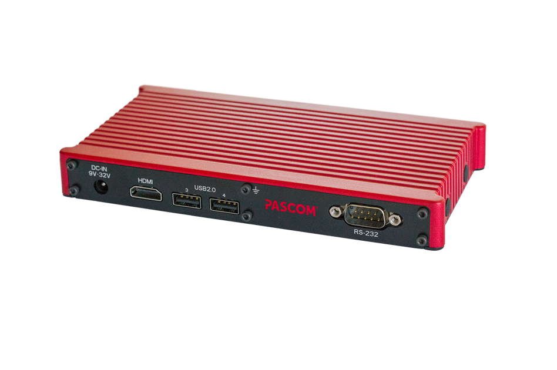
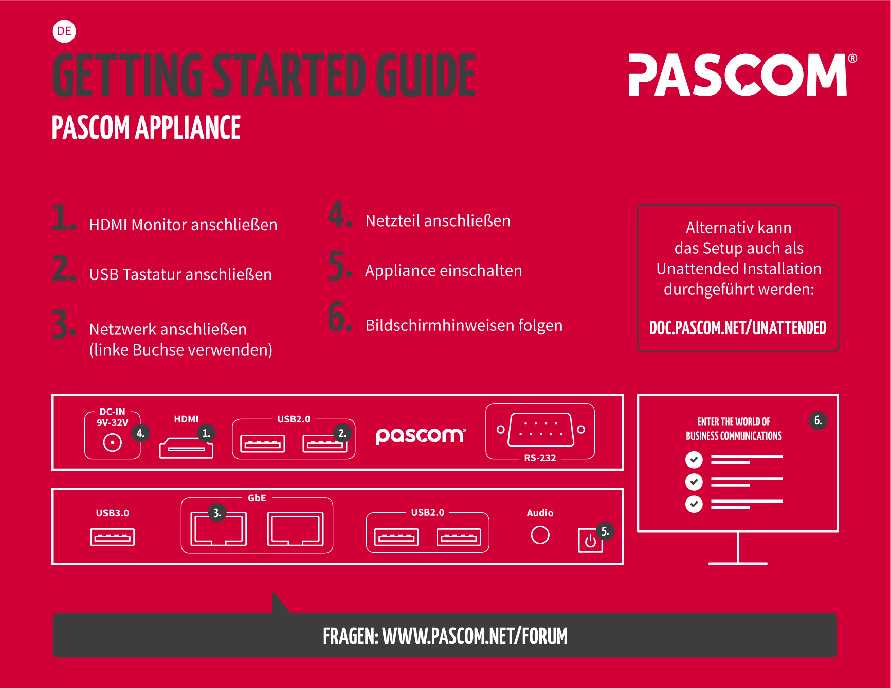
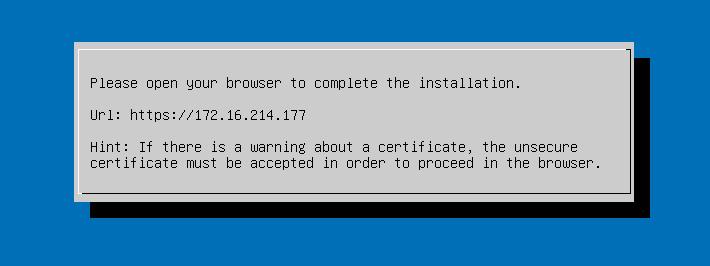




 
**Nützliches Vorwissen**
 
 
 * [pascom Server Systemaufbau]()

 
## pascom Appliance

## pascom Server installieren (nur bei Neuinstallation)
{}
Im Auslieferungszustand ist der pascom Server bereits vorinstalliert. Führen Sie diesen Schritt nur dann aus wenn Sie eine Neuinstallation des Systems vornehmen möchten!
{}

### Vorraussetzungen

* USB-Stick mit mindestes 8 GB Kapazität
* Kostenlosen Flash Tool [Etcher](https://etcher.io/) (erhältich für Windows, Linux und MacOS)
* pascom Server [ISO-Dateien](https://www.pascom.net/de/download/)
 
### USB-Stick flashen

Verbinden Sie den USB-Stick mit Ihrem Computer und starten Sie das Tool Etcher. Wählen Sie nun das pascom Server ISO unter , wählen Sie den USB-Stick via  und klicken Sie im Anschluss auf :

### USB-Stick anstecken

Den so vorbereiteten USB-Stick können Sie nun direkt an den USB3 Port (Rückseite, blauer Port) anstecken.

## Appliance anschließen

{} Schnellstartanleitung herunterladen{}

## Erster Systemstart

Komplettieren Sie das Setup und folgen Sie den Anweisungen am Bildschrim bis Sie dazu aufgefordert werden in Ihren Browser zu wechseln um den Setup Wizard zu starten:

## Setup Wizard starten

Öffnen Sie einen Brwoser und surfen auf die so eben konfigurierte IP-Adresse Ihres pascom Servers. Folgen Sie den Anweisungen bis Sie sich am Management Interface anmelden können:

## Mobilzugriffe via Internet einrichten (optional)

{}
Wenn Sie dieses Feature nutzen möchten führen Sie diese Schritte jetzt aus. Spätere Änderungen sind möglich, führen jedoch auch zu Änderungen für Ihre Benutzer da sich z.B. der Zugriff auf den Server via pascom Client von einer lokalen IP auf einen DNS Namen ändert. 
{}

Dieser Schritt ist notwending falls Sie Ihren lokalen pascom Server auch von unterwegs per pascom Mobileclient (iOS/Android App) oder Desktopclient nutzen möchten. 

 * Siehe [Mobilzugriffe via Internet einrichten]()

## Telefonanlage einrichten

Ein weiterer Assistent hilft ihnen dabei Ihre Telefonanlage ferig einzurichten und weitere Benutzer anzulegen, bzw. einzuladen.
Gehen Sie hierzu wie folgt vor:

* Melden Sie sich per Browser am pascom Server als admin an
* Klicken Sie auf  und dann auf den Namen Ihrere Anlage
* Folgen Sie den Anweisungen des Assistenten

