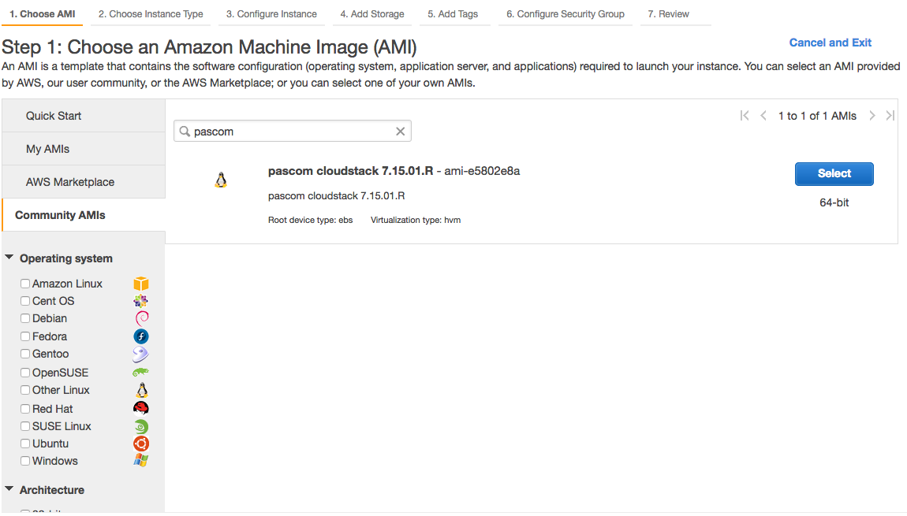
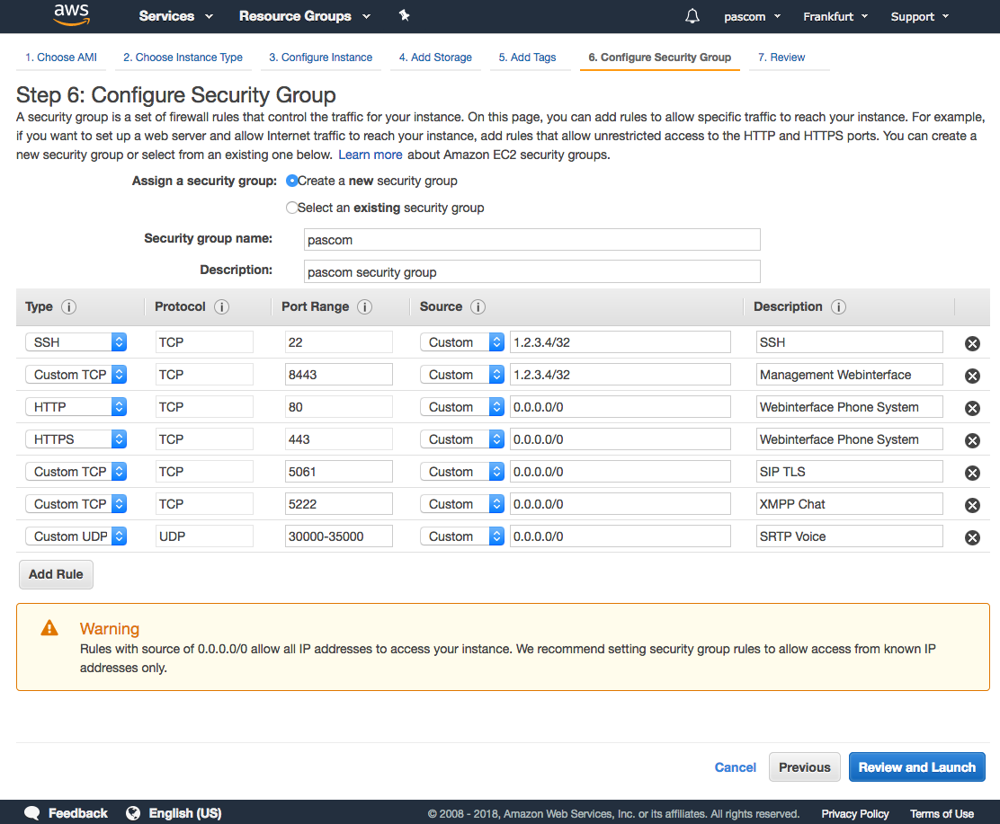

 
 


## Recommeded AWS Instance Sizes

|   |< 10 Users|< 50 Users|< 250 Users|< 500 Users|< 1000 Users|
|---|---|---|---|---|---|
|**Instance Type1**|t2.small| t2.medium |t2.large| t2.xlarge | t2.2xlarge |
|**EBS Volume2**|32 GB|64 GB|128 GB|256 GB|512 GB|

**1)** By higher CPU loads, it is advisable to choose the fee-based "t2 unlimited" option. The load depends on entirely on the respective user behaviour. Therefore, our recommendation is to start without the option and monitor the instance using the AWS monitoring tools. 

**2)** In standard use cases, the pascom does not generate a high IO load. As such, the volume type "magnetic" is sufficient. 

## AWS Instance Setup

pascom has made a **Community AMI** available at the AWS Frankfurt site:

Continue with the AWS instance setup and make all further settings changes according to our recommendations until you reach step 6 **Configure Security Group**.

### Configure Security Group

#### Management

{}
You must be able to access the following ports as an Administrator. Under **no circumstances** share these ports with unrestricted internet access. The simplest option here is to restrict the source IP address to name of your company network. Alternatively, you can use a VPN or a direct AWS connection.
{}

| Port | Description |
| ---- | ------------ |
| TCP **22** | SSH Server |
| TCP **8443** | Management Web Interface |

#### Telephony and Instant Messaging

{}
To use the telephony and instant messaging services, open these ports for unrestricted access via the Internet. 
{}

| Port | Description |
| ---- | ------------ |
| TCP **80**/**443** | Phone system Web Interface - Important for Let's Encrypt certificates |
| TCP **5061** | SIP-TLS - secure SIP communication |
| TCP **5222** | pascom Desktop and Mobile client access |
| UDP **30000 - 35000** | SRTP - encrypted Voice Data |
| UDP **3478** | Access for Video-Functionality |

#### Optional Services

{}
Provide the following ports unrestricted access via the Internet only when you actually use the following services. 
{}

| Port | Description |
| ---- | ------------ |
| TCP **636** | LDAPS for telephone book access via LDAP |
| TCP **8884**  | Provisioning of Desktop IP Phones (hardware telephones) |
| TCP **8885**  | VPN Tunnel direct to the phone system |

#### Example Configuration

In this example configuration, we used the fixed source IP address of **1.2.3.4** to secure the management Interface: 

### AWS SSH Key Pair

The pascom Server **does not** require any AWS SSH Key Pairs. Therefore, select **Proceed without a key pair** and start the instance. Lastly, you can set the passwords via the pascom Server Management.

## Start pascom Setup Wizard

Open a browser window and surf to your pascom server's AWS IP address. Follow the instructions until you can login to the pascom management UI:

## Domain Name Setup

As valid certificates can only be created using the domain name and not IP addresses, you will now need to setup a domain name for the external AWS IP address.

Should you not have your own, external DNS server available,[no-ip](https://www.noip.com/) offers an easy way to setup domain names.

## Activate Let's Encrypt 

The pascom phone system server has the capability to fully and automatically setup a Let's Encrypt certificate for you. Simply follow these steps:

* Using an admin account, login to the pascom server Web UI
* Click 
* Click  on the interface used by you
* Under  enter the previously setup 
* Switch the the  to 
* Press  to apply the configuration

The Interface will now restart and automatically applies the Let's Encrypt Certificate. Should the interface restart encounter errors, please check your Firewall Settings, in particular Port TCP 443 and your domain name.

## Phone System Setup

An additionnal assistant will help you to finish setting up your phone system and add / invite further users.
Proceed as follows: 

* Via a browser window, login into the pascom server as an Admin
* Click on the  and then enter a name for your phone system
* Follow the setup assistant instructions