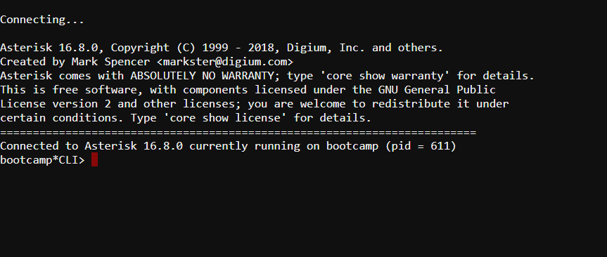






{}
{}

## Zugriff auf die pascom CLI Oberfläche

Die pascom CLI ist eine textbasierte (TUI) Oberfläche in der Sie verschieden Befehle zum Debuggen verwenden können. Die Basis dieser Oberfläche
bildet das Asterisk Kern System, welches in der pascom Telefonanlage integriert ist.  

Um Zugriff auf die CLI Oberfläche zu erhalten, klicken Sie in der oberen linken Ecke der Admin Web Oberfläche auf das kleine **schwarze Shell-Symbol**.  


Sie befinden sich nun in der pascom CLI



Von hier aus können Sie Asterisk-Befehle nutzen um die pascom Telefonanlage zu debuggen, Telefonate auszuwerten, Kanäle und Verbindungen auslesen und vieles mehr. 

[Asterisk Befehlsliste](https://www.voip-info.org/asterisk-cli/)  

**Astersik Tutorial Series incl. SIP Debugging (only EN)**



## Root Zugriff auf die pascom Telefonanlage

Das pascom Telefonsystem läuft auf einem Linuxsystem, auf welches Sie in der Onsite-Variante vollen Root-Zugriff erhalten. Dies erlaubt es, auf das Dateisystem der pascom Telefonanlage zuzugreifen. 

### IP Adresse ermitteln

Um auf das System zugreifen zu können, benötigen Sie die IP-Adresse der Telefonanlage.
Falls Sie eine vorinstallierte IP Telefonanlage erworben haben, entnehmen Sie die IP aus dem Beiblatt oder der Beschriftung an den Netzwerkschnittstellen.
Wenn Sie sich mit der IP-Adresse nicht sicher sind, können Sie einen Monitor an der pascom anschließen und die IP am pascom TUI ablesen. Alternativ nutzen Sie Netzwerkscanner wie Nmap oder schauen sich die IP-Tabelle Ihres DHCP Server an. 

### Zugriff über SSH

Nutzen Sie ein Terminal Ihrer Wahl (z.B. Putty für Windows) und loggen Sie sich ein mit:

```
ssh admin@192.168.100.1
```

**Benutzer**: admin  
**Passwort**: von Ihnen vergeben

Anschließend benötigen Sie Root-Rechte, da der Zugriff sonst sehr eingeschränkt ist. Dies erhalten Sie mit dem Befehl **su** oder **sudo su** und der Eingabe des zuvor benutzen Passwords.

```
---
Welcome to your asterisk PBX, admin!
You may need to use sudo or su to become root...
---
admin@pascom:~$ su
Password:
```
Alle Integrierten Dienste wie, Dateisystem, Session Border Controller oder die Ethernetschnittstellen laufen in Containern. Um sich alle Container anzeigen zu lassen benutzen Sie den Befehl **lxc-ls -f**.

```
NAME       STATE   AUTOSTART GROUPS IPV4                    IPV6
controller RUNNING 0         cs     10.0.3.175              -
frei       RUNNING 0         cs     10.0.3.117              -
ifenp1s0   RUNNING 0         cs     10.0.3.1, 10.1.3.2      -
ifenp4s0   RUNNING 0         cs     10.0.3.199, 10.1.3.3    -
pg         RUNNING 0         cs     10.0.3.142              -
temp       STOPPED 0         cs     -                       -
werkstatt  RUNNING 0         cs     10.0.3.116, 172.16.23.1 -
```
Um in einen Container zu wechseln, z.B dem Dateisystem der pascom Telefonanlage, nutzen Sie den Befehl **lxc-attach -n werkstatt**.
Lassen Sie sich die Ordnerstruktur mit dem Befehl **ls -ltr** anzeigen. 

```
drwxr-xr-x   3 root root 4096 Feb 28 09:56 BACKUP
drwxr-xr-x  10 root root  150 Jun 23 09:42 usr
drwxr-xr-x   2 root root    3 Jun 23 09:42 srv
drwxr-xr-x   2 root root    3 Jun 23 09:42 opt
drwxr-xr-x   2 root root    3 Jun 23 09:42 media
drwxr-xr-x   2 root root   43 Jun 23 09:43 lib64
drwxr-xr-x   2 root root 1977 Jun 24 11:15 bin
drwxr-xr-x   2 root root 2030 Jun 24 11:15 sbin
drwxr-xr-x  12 root root  252 Jun 24 11:15 lib
drwxr-xr-x   2 root root    3 Jun 24 11:16 home
drwxr-xr-x  22 root root 4096 Jul  7 11:19 var
dr-xr-xr-x 307 root root    0 Jul  7 11:19 proc
dr-xr-xr-x  13 root root    0 Jul  7 11:19 sys
drwxr-xr-x   8 root root  500 Jul  7 11:19 dev
drwxr-xr-x 117 root root 4096 Jul  7 11:19 etc
drwxr-xr-x   4 root root 4096 Jul  7 11:19 root
drwxr-xr-x  19 root root  640 Jul  7 11:19 run
drwxrwxrwt  15 root root 4096 Jul  7 11:21 tmp
root@werkstatt:/#
```

Von hieraus gelangen Sie mit dem Befehl **asterisk -r** in die pascom CLI und können dort die Telefonie debuggen.

```
Asterisk comes with ABSOLUTELY NO WARRANTY; type 'core show warranty' for details.
This is free software, with components licensed under the GNU General Public
License version 2 and other licenses; you are welcome to redistribute it under
certain conditions. Type 'core show license' for details.
=========================================================================
Connected to Asterisk 16.8.0 currently running on werkstatt (pid = 705)
werkstatt*CLI>
```
{}
Updaten Sie das pascom System niemals über den **APT Befehl**. Nutzen Sie dazu folgende [Update Anleitung]() um 
Ihr System auf die neuste Version zu bringen.
{}

{}

{}
## Zugriff auf die pascom CLI Oberfläche

Die pascom CLI ist eine textbasierte (TUI) Oberfläche in der Sie verschieden Befehle zum Debuggen verwenden können. Die Basis dieser Oberfläche
bildet das Asterisk Kern System, welches in der pascom Telefonanlage integriert ist.  

Um Zugriff auf die CLI Oberfläche zu erhalten, klicken Sie in der oberen linken Ecke der Admin Web Oberfläche auf das kleine **schwarze Shell-Symbol**.  


Sie befinden sich nun in der pascom CLI


Von hier aus können Sie Asterisk-Befehle nutzen um die pascom Telefonanlage zu debuggen, Telefonate auszuwerten, Kanäle und Verbindungen auslesen und vieles mehr. 

[Asterisk: The Future of Telephony](http://www.asteriskdocs.org/en/2nd_Edition/asterisk-book-html-chunk/index.html)  

**Astersik Tutorial Series incl. SIP Debugging (only EN)**



{}
**Ein Root Zugriff auf pascom Cloud Telefonsysteme ist nicht möglich**
{}

{}
{}

