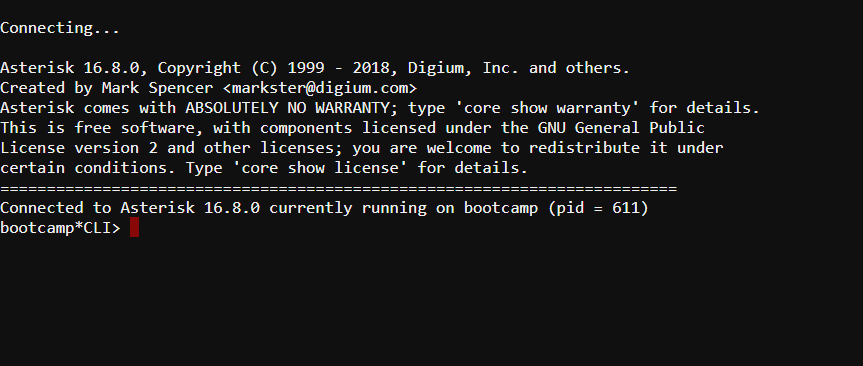






{}
{}

## Access to the pascom CLI Interface

The pascom CLI is a text-based (TUI) interface in which you can use various commands for debugging. The basis of this interface
forms the Asterisk core system, which is integrated in the pascom telephone system.  

To access the CLI interface, click on the small **black shell symbol** in the upper left corner of the Admin Web Interface.


You are now in the pascom CLI



From here you can use Asterisk commands to debug the pascom telephone system, evaluate telephone calls, read out channels and connections and much more.

[Asterisk Command List](https://www.voip-info.org/asterisk-cli/)  

**Astersik Tutorial Series incl. SIP Debugging (only EN)**



## Root access to the pascom telephone system

The pascom telephone system operates on a Linux system to which you have full root access in the onsite version. This allows you to access the file system of the pascom telephone system. 

### Determine IP address

To access the system, you need the IP address of the telephone system.
If you have purchased a pre-installed IP telephone system, please refer to the IP on the supplement or the label on the network interfaces.
If you are not sure of the IP address, you can connect a monitor to the pascom and read the IP on the pascom TUI. Alternatively, use network scanners such as Nmap or look at the IP table of your DHCP server. 


### Access via SSH

Use a terminal of your choice (e.g. Putty for Windows) and log in:

```
ssh admin@192.168.100.1
```

**User**: admin  
**Password**: assigned by you

You will then need root rights, otherwise access will be very restricted. You can get this with the command **su** or **sudo su** and by entering the password you used before.

```
---
Welcome to your asterisk PBX, admin!
You may need to use sudo or su to become root...
---
admin@pascom:~$ su
Password:
```
All integrated services like the file system, Session Border Controller or the Ethernet interfaces run in containers. To display all containers use the command **lxc-ls -f**.

```
NAME       STATE   AUTOSTART GROUPS IPV4                    IPV6
controller RUNNING 0         cs     10.0.3.175              -
frei       RUNNING 0         cs     10.0.3.117              -
ifenp1s0   RUNNING 0         cs     10.0.3.1, 10.1.3.2      -
ifenp4s0   RUNNING 0         cs     10.0.3.199, 10.1.3.3    -
pg         RUNNING 0         cs     10.0.3.142              -
temp       STOPPED 0         cs     -                       -
werkstatt  RUNNING 0         cs     10.0.3.116, 172.16.23.1 -
```
To change to a container, e.g. the file system of the pascom telephone system, use the command **lxc-attach -n werkstatt**.
Display the folder structure with the command **ls -ltr**. 

```
drwxr-xr-x   3 root root 4096 Feb 28 09:56 BACKUP
drwxr-xr-x  10 root root  150 Jun 23 09:42 usr
drwxr-xr-x   2 root root    3 Jun 23 09:42 srv
drwxr-xr-x   2 root root    3 Jun 23 09:42 opt
drwxr-xr-x   2 root root    3 Jun 23 09:42 media
drwxr-xr-x   2 root root   43 Jun 23 09:43 lib64
drwxr-xr-x   2 root root 1977 Jun 24 11:15 bin
drwxr-xr-x   2 root root 2030 Jun 24 11:15 sbin
drwxr-xr-x  12 root root  252 Jun 24 11:15 lib
drwxr-xr-x   2 root root    3 Jun 24 11:16 home
drwxr-xr-x  22 root root 4096 Jul  7 11:19 var
dr-xr-xr-x 307 root root    0 Jul  7 11:19 proc
dr-xr-xr-x  13 root root    0 Jul  7 11:19 sys
drwxr-xr-x   8 root root  500 Jul  7 11:19 dev
drwxr-xr-x 117 root root 4096 Jul  7 11:19 etc
drwxr-xr-x   4 root root 4096 Jul  7 11:19 root
drwxr-xr-x  19 root root  640 Jul  7 11:19 run
drwxrwxrwt  15 root root 4096 Jul  7 11:21 tmp
root@werkstatt:/#
```

From here you can access the pascom CLI with the command **asterisk -r** and debug the telephony.

```
Asterisk comes with ABSOLUTELY NO WARRANTY; type 'core show warranty' for details.
This is free software, with components licensed under the GNU General Public
License version 2 and other licenses; you are welcome to redistribute it under
certain conditions. Type 'core show license' for details.
=========================================================================
Connected to Asterisk 16.8.0 currently running on werkstatt (pid = 705)
werkstatt*CLI>
```
{}
Never update the pascom system using the **APT command**. Use the following [Update Guide]()
to update your system to the latest version.
{}

{}

{}
## Access to the pascom CLI Interface

The pascom CLI is a text-based (TUI) interface in which you can use various commands for debugging. The basis of this interface
forms the Asterisk core system, which is integrated in the pascom telephone system.  

To access the CLI interface, click on the small **black shell symbol** in the upper left corner of the Admin Web Interface.


You are now in the pascom CLI


From here you can use Asterisk commands to debug the pascom telephone system, evaluate telephone calls, read out channels and connections and much more.

[Asterisk: The Future of Telephony](http://www.asteriskdocs.org/en/2nd_Edition/asterisk-book-html-chunk/index.html)  

**Astersik Tutorial Series incl. SIP Debugging (only EN)**



{}
**Root access to the pascom cloud phone system is not possible**
{}

{}
{}

