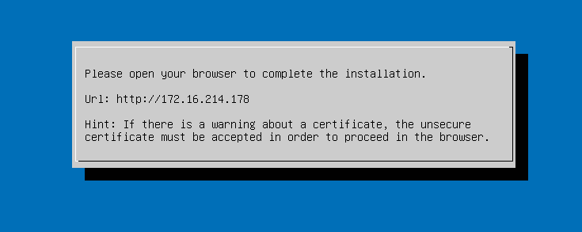
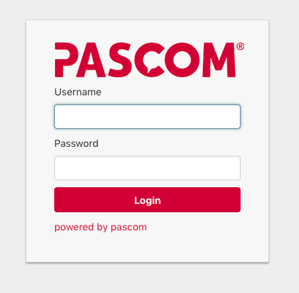


 



{}
In order to be able to create and operate CSP Hosts in my.pascom.net, you must be a CSP partner. Please contact our sales team to receive further information. 
{}

## What is a CSP?

CSPs are pascom partners who want to add a pascom **Hosting offer themselves**. The pascom server is **multi-tenant** and **multi-host** enabled and therefore is the ideal platform for Hosted Service Providers.

## System Setup

As a CSP you can deploy any number of **CSP Hosts**. Each host can then manage up to **32 phone systems** (separate customers).  

Each Host has its own Domain-Name. e.g.:

```bash
pbx1.superhoster.com
pbx2.superhoster.com
...
```

The individual phone systems are reachable via the corresponding host: 

```bash
pbx1.superhoster.com/customer1
pbx1.superhoster.com/customer2
pbx2.superhoster.com/customer3
...
```

## System Requirements

**VMware ESX 6.5 or higher** is a prerequisite regarding the Hypervisor. **Each CSP Host (32 phone systems)** have the following system requirements:

| Ressource | Size |
|---|---|
|**CPU (x86)**|4 Core|
|**RAM**|48 GB|
|**Disk Storage \***|64 GB|

**\*** Calculating disk storage capacity is based on an average usage. In particular, call recordings can significantly impact storage requirements. Please calculate an additional 1 MB per 10 minutes of recordings. 

## CSP Host Setup

### Create CSP Host in my.pascom.net

Log into **my.pascom.net** and under  >  add a new CSP host via . You can add as many CSP hosts as you wish. CSP hosts are not associated with any additional costs. 

### Download ISO File

For the installation of the CSP host, please download the **pascom Server ISO 18.5 or higher** from our website [Downloads pahe](https://www.pascom.net/en/downloads/).

### Operating System Installation

Create a new virtual machine and use the pascom server [ISO file](https://www.pascom.net/en/downloads/) as the boot medium. Follow the on screen instructions until you are instructed to switch to your browser in order to start the setup wizard:



### Start Setup Wizard

Open your browser and go to the previously configure IP address of your pascom server. Follown the instructions until you can login to the management interface:



### Setup up Mobile Access via the Internet

{}
Follow these steps BEFORE you deploy and start the first phone system. Later changes are possible, but will result in changes for your customers.
{}

This step in necessary so that your customers can use the mobile client app (iOS/Android) or the desktop client. 

 * See [Setup Mobile Access via the Internet]()


## Setup Customer Phone Systems

Should a **minimu of one CSP Host be setup** you can add **FREE-, BASIC- and PREMIUM subscriptions** for your customers and start the corresponding phone systems. 

### (Option A) Add Phone System on CSP Host

Log into the **CSP host Management UI** and under click  on . 

You will now be redirected to my.pascom.net where you can add a new subscription for your customer.

Back on the CSP host, a job will automatically start to update the subscription.

After a few seconds, the newly added subscription will appear under the phone systems and can now be setup for your customer.


### (Option B) Add Phone System via my.pascom.net

Log into **my.pascom.net** and under  >  add a new phone system via .

During the process, you will have the option of selecting your CSP host instead of the pascom.cloud or an on-site installation.

Once the process is finished, log into your **CSP host Management UI** and under refresh your licence via  > .

After a few seconds, the newly added subscription will appear under the phone systems and can now be setup for your customer.


