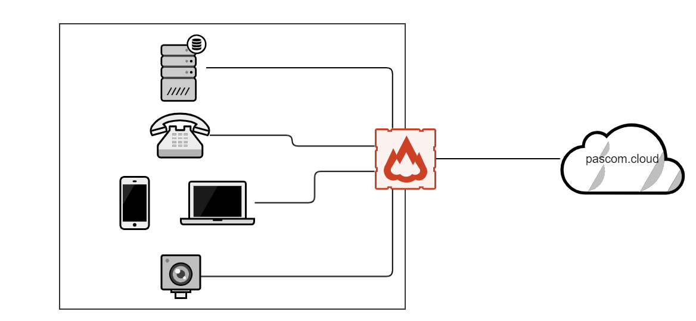
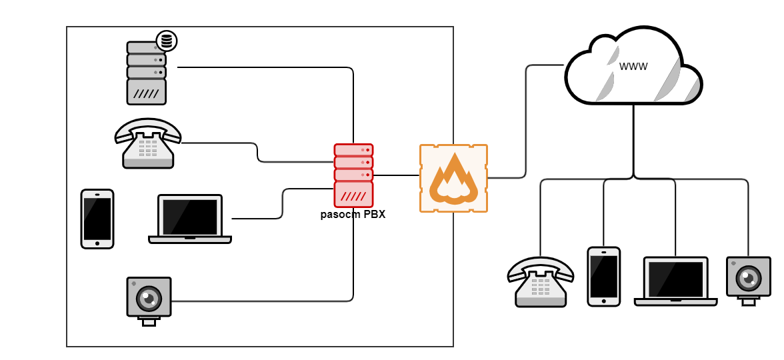





## Ihre Firewall anpassen

Viele Unternehmen haben **keinen eingeschränkten Internetzugriff** und können den **pascom Server** daher **sofort**, ohne jede Anpassung an der Firewall **nutzen**.

Wenn Sie jedoch genau festlegen auf welche Internetdienste Ihr Unternehmensnetzwerk zugreifen darf, schalten Sie bitte folgende Ports in Ihrer Firewall frei, um einen reibungslosen Betrieb der [pascom Telefonanlage](https://www.pascom.net/de/voip-telefonanlage/ "pascom VoIP Telefonanlage") zu ermöglichen:

{}
{}

| Port | Funktion | Gerät | Ziel|
| ---- | ---- | ------------ |-----|
|5061|SIP-Verbindung|<i class="fas fa-desktop"></i>  <i class="fas fa-phone"></i>  <i class="fas fa-mobile-alt"></i>|pascom.cloud|
|30.000-35.000|RTP-Sprache|<i class="fas fa-desktop"></i>  <i class="fas fa-phone"></i>  <i class="fas fa-mobile-alt"></i>|*|
|636|LDAPS, Telefonbuch| <i class="fas fa-phone"></i> |*|
|8884|Telefonprovisionierung| <i class="fas fa-phone"></i> |*|
|80 / 443|Updates, Push| <i class="fas fa-desktop">  <i class="fas fa-mobile-alt"></i></i> |mypascom.net|
|3478|Video-Funktionalität| <i class="fas fa-desktop">  <i class="fas fa-mobile-alt"></i></i> |*|
|5222|Chat| <i class="fas fa-desktop">  <i class="fas fa-mobile-alt"></i></i> |*|
|19302|WebRTC - WebClient| <i class="fas fa-video"></i> |*|
|8885|VPN Tunnel zur PBX| <i class="fas fa-server"></i> |*|

 
#### Legende
<i class="fas fa-server"></i>  =  pascom Server  
<i class="fas fa-desktop"></i>  =  Desktop Client  
<i class="fas fa-mobile-alt"></i>  = Mobile Client  
<i class="fas fa-phone"></i>  =  IP-Telefon  
<i class="fas fa-video"></i>  =  WebClient

{}

{}

| Port | Funktion | Gerät | Ziel|
| ---- | ---- | ------------ |-----|
|80 / 443|Lizenzserver|<i class="fas fa-server"></i> |mypascom.net|
|25|Zugriff zum pascom Mailserver|<i class="fas fa-server"></i> |cloudmx1.pascom.net, cloudmx2.pascom.net|
|123|Zugriff zum Zeitserver (NTP)| <i class="fas fa-server"></i> |*|

 

Für einen Zugriff Ihrer Geräte über das Internet in Ihr Netzwerk zur pascom Telefonanlage benötigen Sie die selben Portfreigaben wie bei der Cloud Variante. (bzw. auch bei Subnetzen)

| Port | Funktion | Gerät | Ziel|
| ---- | ---- | ------------ |-----|
|5061|SIP-Verbindung|<i class="fas fa-desktop"></i>  <i class="fas fa-phone"></i>  <i class="fas fa-mobile-alt"></i>|pascom.cloud|
|30.000-35.000|RTP-Sprache|<i class="fas fa-desktop"></i>  <i class="fas fa-phone"></i>  <i class="fas fa-mobile-alt"></i>|*|
|636|LDAPS, Telefonbuch| <i class="fas fa-phone"></i> |*|
|8884|Telefonprovisionierung| <i class="fas fa-phone"></i> |*|
|80 / 443|Updates, Push| <i class="fas fa-desktop">  <i class="fas fa-mobile-alt"></i></i> |mypascom.net|
|3478|Video-Funktionalität| <i class="fas fa-desktop">  <i class="fas fa-mobile-alt"></i></i> |*|
|5222|Chat| <i class="fas fa-desktop">  <i class="fas fa-mobile-alt"></i></i> |*|
|19302|WebRTC - WebClient| <i class="fas fa-video"></i> |*|
|8885|VPN Tunnel zur PBX| <i class="fas fa-server"></i> |*|

 
#### Legende
<i class="fas fa-server"></i>  =  pascom Server  
<i class="fas fa-desktop"></i>  =  Desktop Client  
<i class="fas fa-mobile-alt"></i>  = Mobile Client  
<i class="fas fa-phone"></i>  =  IP-Telefon  
<i class="fas fa-video"></i>  =  WebClient
{}
{}

