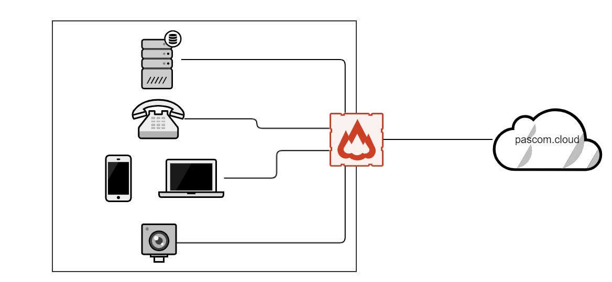





## Configure your firewall

Many companies have **no restricted Internet access** and can therefore use the **pascom server** immediately, without any adjustment to the firewall.

However, if you specify exactly which Internet services your company network may access, please activate the following ports in your firewall to allow smooth operation of the [pascom phone system](https://www.pascom.net/en/business-phone-system/ "pascom VoIP telephone system")

{}
{}

| Port | Function | Device | Target |
| ---- | ---- | ------------ |-----|
|5061|SIP-Connection|<i class="fas fa-desktop"></i>  <i class="fas fa-phone"></i>  <i class="fas fa-mobile-alt"></i>|pascom.cloud|
|30.000-35.000|RTP-Voice|<i class="fas fa-desktop"></i>  <i class="fas fa-phone"></i>  <i class="fas fa-mobile-alt"></i>|*|
|636|LDAPS, Phonebook| <i class="fas fa-phone"></i> |*|
|8884|Phone Provisioning| <i class="fas fa-phone"></i> |*|
|80 / 443|Updates, Push| <i class="fas fa-desktop">  <i class="fas fa-mobile-alt"></i></i> |mypascom.net|
|3478|Video-Functionality| <i class="fas fa-desktop">  <i class="fas fa-mobile-alt"></i></i> |*|
|5222|Chat| <i class="fas fa-desktop">  <i class="fas fa-mobile-alt"></i></i> |*|
|19302|WebRTC - WebClient| <i class="fas fa-video"></i> |*|
|8885|VPN Tunnel to PBX| <i class="fas fa-server"></i> |*|

 
#### Legend
<i class="fas fa-server"></i>  =  pascom Server  
<i class="fas fa-desktop"></i>  =  Desktop Client  
<i class="fas fa-mobile-alt"></i>  = Mobile Client  
<i class="fas fa-phone"></i>  =  IP-Phone  
<i class="fas fa-video"></i>  =  WebClient

{}

{}

| Port | Funktion | Gerät | Ziel|
| ---- | ---- | ------------ |-----|
|80 / 443|Licenseserver|<i class="fas fa-server"></i> |mypascom.net|
|25|Access to pascom Mailserver|<i class="fas fa-server"></i> |cloudmx1.pascom.net, cloudmx2.pascom.net|
|123|Access to TimeServer (NTP)| <i class="fas fa-server"></i> |*|

 

To access your devices via the Internet in your network to the pascom telephone system, you need the same port clearances as for the cloud variant. (or also with subnets)

| Port | Function | Device | Target |
| ---- | ---- | ------------ |-----|
|5061|SIP-Connection|<i class="fas fa-desktop"></i>  <i class="fas fa-phone"></i>  <i class="fas fa-mobile-alt"></i>|pascom.cloud|
|30.000-35.000|RTP-Voice|<i class="fas fa-desktop"></i>  <i class="fas fa-phone"></i>  <i class="fas fa-mobile-alt"></i>|*|
|636|LDAPS, Phonebook| <i class="fas fa-phone"></i> |*|
|8884|Phone Provisioning| <i class="fas fa-phone"></i> |*|
|80 / 443|Updates, Push| <i class="fas fa-desktop">  <i class="fas fa-mobile-alt"></i></i> |mypascom.net|
|3478|Video-Functionality| <i class="fas fa-desktop">  <i class="fas fa-mobile-alt"></i></i> |*|
|5222|Chat| <i class="fas fa-desktop">  <i class="fas fa-mobile-alt"></i></i> |*|
|19302|WebRTC - WebClient| <i class="fas fa-video"></i> |*|
|8885|VPN Tunnel to PBX| <i class="fas fa-server"></i> |*|

 
#### Legend
<i class="fas fa-server"></i>  =  pascom Server  
<i class="fas fa-desktop"></i>  =  Desktop Client  
<i class="fas fa-mobile-alt"></i>  = Mobile Client  
<i class="fas fa-phone"></i>  =  IP-Phone  
<i class="fas fa-video"></i>  =  WebClient
{}
{}

