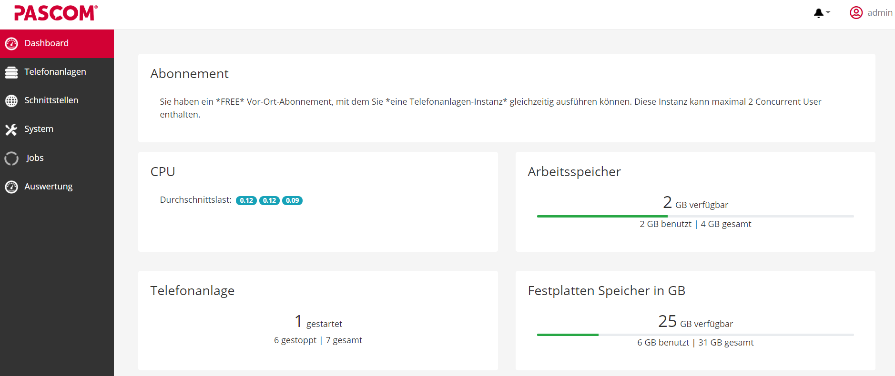
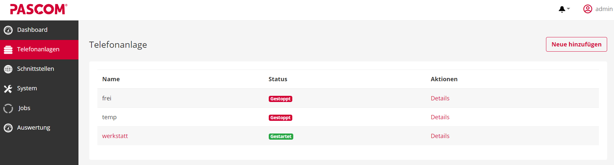
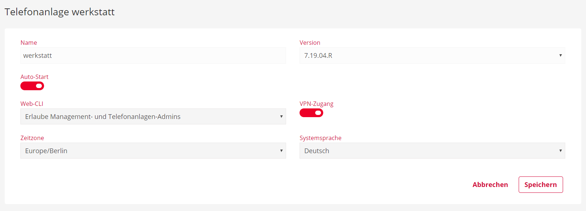
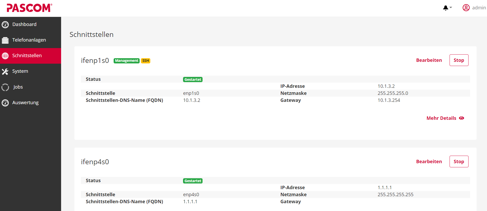
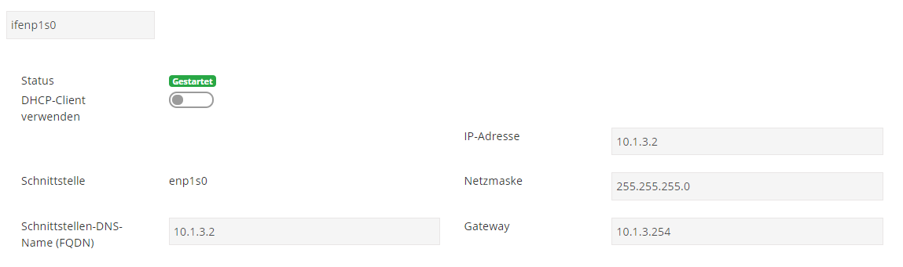
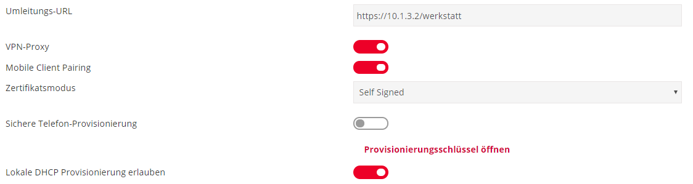
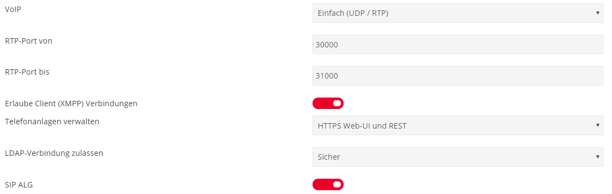
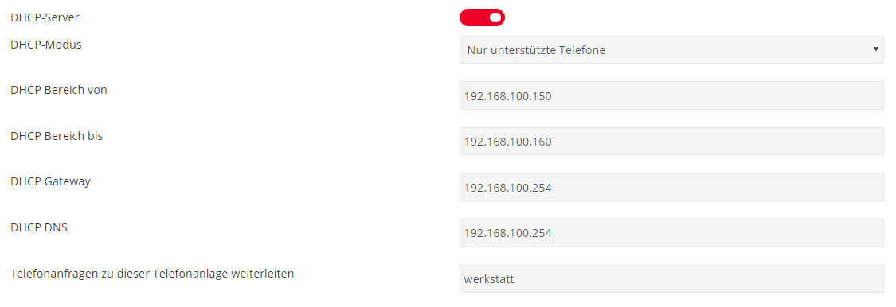
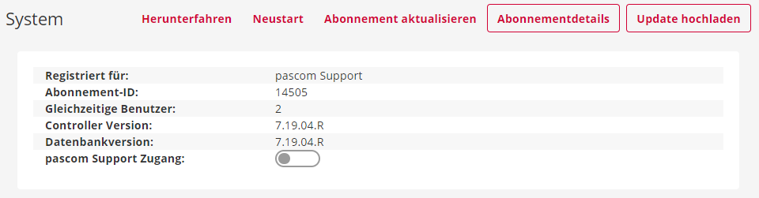





## Server Management Oberfläche aufrufen und anmelden

Um auf die Server Management Oberfläche zu gelangen, rufen Sie über Ihren Browser die Managementadresse Ihrer pascom Anlage auf. Diese setzt sich zusammen aus
der IP- oder DNS Adresse, gefolgt vom Management-Port. (**z.B. 10.1.3.2:8443 oder meinetollepascom:8443**)

**Management-Port: 8443**

Für den Login verwenden Sie, die im Setup Assistenten vergebenen Daten für Ihren **Admin Account**.

- Benutzer: **admin**
- Passwort: **von Ihnen vergeben**

## Das Dashboard

Im Dashboard der pascom Management Oberfläche finden Sie generelle Informationen zur Performance der pascom Appliance.

|Bezeichnung|Beschreibung|
|---|---|
|CPU|Zeigt die prozentuale Auslastung des Linux-Kernel.  Diese werden berechnet aus **Benutzerprozessen**, **High-Prio Prozessen**, **System-Ressourcen** und dem **Leerlaufanteil des Prozessors**.   Weitere [Infos](https://de.wikipedia.org/wiki/Load#Prozentuale_Auslastungswerte_bei_Linux). |
|Arbeitsspeicher| Zeigt an, wieviel Arbeitsspeicher gesamt vorhanden ist und wieviel davon zur Verfügung steht und benutzt wird.|
|Festplatte| Zeigt an, wieviel Festplattenspeicher gesamt vorhanden ist und wieviel davon zur Verfügung steht und benutzt wird.|
|Telefonanlage| Zeigt an, wieviele Telefoninstanzen auf der pascom Appliance vorhanden sind und wieviele gerade laufen.|

## Die Telefonanlagen

Hier finden Sie eine Auflistung Ihrer Telefoninstanzen auf der pascom Appliance.

{}
Sofern Sie kein **pascom Cloud Service Partner** sind, kann immer nur eine Telefoninstanz auf dem pascom Host **gestartet** werden. 
{}

- über  können Sie eine neue **Telefoninstanz** anlegen.
- über  gelangen Sie zu *erweiterten Einstellungen* der entsprechenden **Telefonanlage**.

### Erweiterte Einstellungen der Telefonanlagen

Um Einstellungen an den Telefoninstanzen vorzunehmen, muss diese erst gestoppt werden. 

{}
Stoppen Sie die Telefonanlage außerhalb Ihrer Geschäftszeiten, da die Anlage in dieser Zeit nicht zur Verfügung steht.
{}

Klicken Sie zum stoppen der Telefonanlage auf den Button .

Anschließend klicken Sie auf .

**Hier können Sie nun einige Einstellungen an Ihrer Telefoninstanz vornehmen:**

- **Auto-Start**: Bestimmen Sie, ob diese Telefonanlage automatisch mit dem Einschalten der Appliance starten soll.
- **Web-CLI**: Legen Sie den Zugriff auf die Web-CLI fest. 
- **VPN-Zugang**: Aktivieren/Deaktivieren Sie den Zugriff via VPN auf die Telefonanlage.
- **Zeitzone**: Legen Sie die Zeitzone der Telefonanlage fest.
- **Systemsprache**: Ändern Sie hier die Sprache der Telefoninstanz. 

### Sicherungen

Eine detailierte Anleitung zum Thema **Sichern und Wiederherstellen** finden sie [hier]().

## Die Schnittstellen

Im Menü der Schnittstellen haben Sie eine Übersicht der vorhandenen Ethernet-Interfaces. Neben der Bezeichnung des Interface und einigen Daten zu Netzwerkadressen, zeigt Ihnen die Übersicht an, ob ein Netzwerkinterface gestartet oder gestoppt ist. 
 

Zusätzlich zeigen Ihnen die kleinen Symbole **Management** und **SSH** über welches Interface Sie auf die **Server Management Oberfläche** gelangen und einen **SSH** Zugang haben. 

Für den **SSH Zugriff** nutzen Sie folgende Daten:  
- Benutzer: **admin**  
- Passwort: **von Ihnen vergeben**

Über den Button  gelangen Sie zu **erweiterten Einstellungen** des entsprechenden Interface.

### Erweiterte Einstellungen der Schnittstellen

In den erweiterten Einstellungen des Netzwerkinterface legen Sie fest, wie Ihre pascom Appliance ereichbar ist und wie die Kommunikation abläuft. 

|Einstellung|Beschreibung|
|---|---|
|**DHCP-Client verwenden**| Aktivieren/Deaktivieren: Interface bekommt automatisch Netzwerkadressen von Ihrem DHCP Server.|
|**DNS - FQDN**| Hier hinterlegen Sie Ihre DNS Adresse.|
|**IP-Adresse, Netzmaske und Gateway**| Bei deaktiviertem DHCP, sind Netzwerkadressen manuell anpassbar.|

 

|Einstellung|Beschreibung|
|---|---|
|**Umleitungs-URL**| Legen Sie fest, zu welcher Telefonanlage bei Aufruf Ihrer IP- / DNS-Adresse weitergeleitet wird.|
|**VPN-Proxy**| Aktivieren/Deaktivieren: OPENVPN Verbindung über Port 8885 ist möglich.|
|**Mobile Pairing**| Aktivieren/Deaktivieren: Ermöglicht das Pairen von Mobilgeräten. Dies kann global abgeschalten werden.|
|**Zertifikatsmodus**| Self Signed (**default**)    Lets Encrypt   oder ein eigenes Zertifikat hochladen.    Zertifizieren und Sichern Sie hier Ihre Verbindung zur pascom Anlage.|
|**Sichere Telefonprovisionierung**| Aktivieren/Deaktivieren: Provisionierung Ihrer Telefone über **unsicher** UDP/RTP oder **sicher** TLS/SRTP.|
|**Lokale DHCP Provisionierung erlauben**| Aktivieren/Deaktivieren: Nutzen Sie Ihren eigenen DHCP-Server für die Provisionierung Ihrer Endgeräte durch sezten der Option66.|

 

|Einstellung|Beschreibung|
|---|---|
|**VoIP**| sicher: TLS/SRTP    unsicher: UDP/RTP   deaktiviert: Keine Sprache möglich.|
|**RTP Port von - bis**| Legen Sie hier fest, über welche Ports, RTP Verbindungen (Sprache) laufen sollen.|
|**Erlaube Client (XMPP) Verbindungen**| Aktivieren/Deaktivieren: Nutzung des pascom Client erlauben/verbieten.|
|**Telefonanlage verwalten**| Legen Sie den Zugriff auf Ihre Telefonanlage fest via Http Web GUI und REST.|
|**LDAP-Verbindungen zulassen**| Konfigurieren Sie die LDAP Verbindung.  sicher (LDAPS), einfach (LDAP) oder deaktiviert.|
|**SIP ALG**| Aktivieren/Deaktivieren: Beeinflusst / korrigiert die pascom SIP Header .|

 

|Einstellung|Beschreibung|
|---|---|
|**DHCP-Server**| Aktivieren/Deaktivieren. Nutzen Sie den DHCP-Server der pascom Appliance|
|**DHCP-Modus**| Legen Sie fest, ob alle DHCP Anfragen beantwortet werden sollen oder nur von **unterstützten Telefonen**.|
|**DHCP-Bereich von - bis**| Legen Sie fest, in welchem IP-Bereich der DHCP-Server IP-Adressen vergeben soll.|
|**Gateway und DNS**| Geben Sie hier die entsprechenden Adressen Ihres Gateways und DNS ein.|
|**Telefonanfragen zu dieser Telefonanlage weiterleiten**| Legen Sie fest, in welcher Telefonanlage die Telefone, bei der automatischen Provisionierung, eingerichtet werden sollen.|

## Das System

Im Systemmenü finden Sie einige Funktionen die den pascom Host direkt betreffen wie Steuerungsoptionen und Firmwareupdates. 

- **Herunterfahren**: Fährt die komplette Appliance herunter, sodass diese sicher ausgeschalten wird.
- **Neustart**: Startet die komplette Appliance neu. 
- **Abonement aktualisieren**: Über diese Funktion prüfen Sie, ob Ihre Lizenz aktuell ist.
- **Abonement details**: Über diesen Button gelangen Sie zu Ihrem MyPascom Konto.
- **Update hochladen**: Über diesen Button spielen Sie eine neue Firmware/Serverversion ein. 

## Firmwares

Eine detailierte Anleitung zu Updates und den Firmwares finden Sie [hier]().
