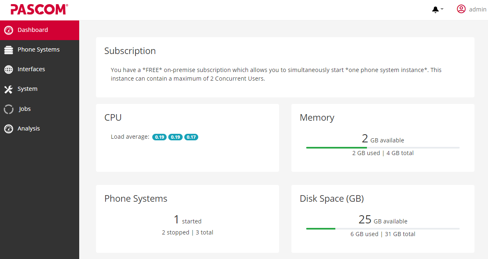
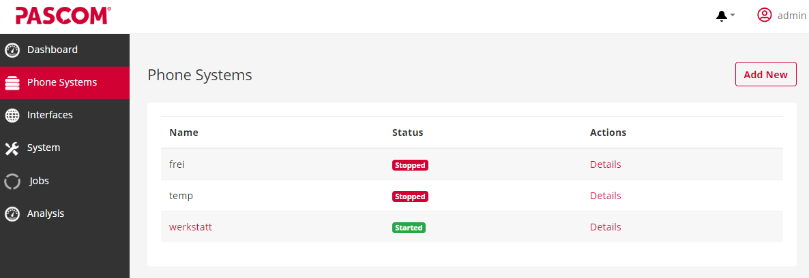
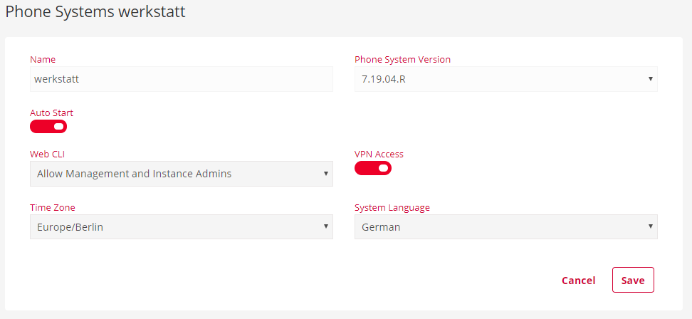
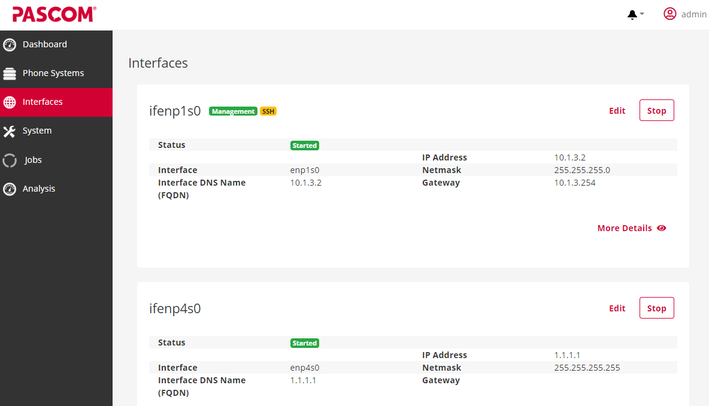
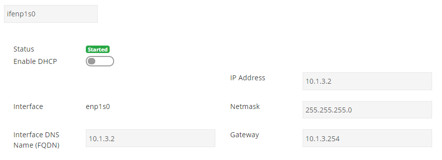
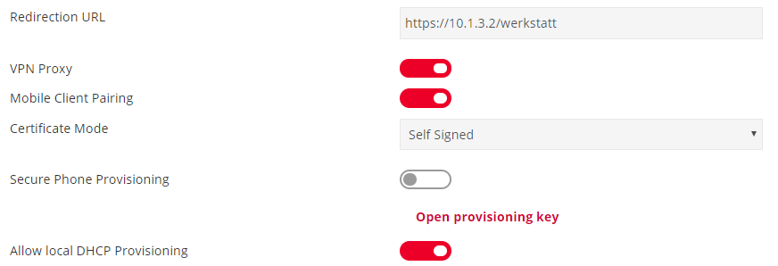
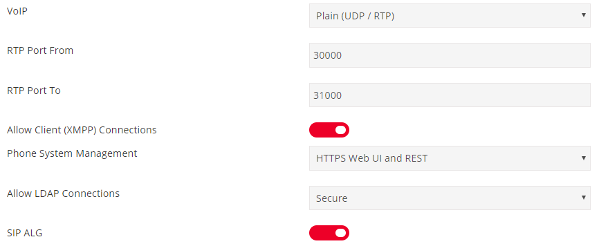
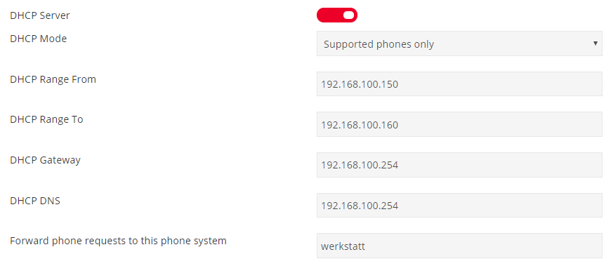
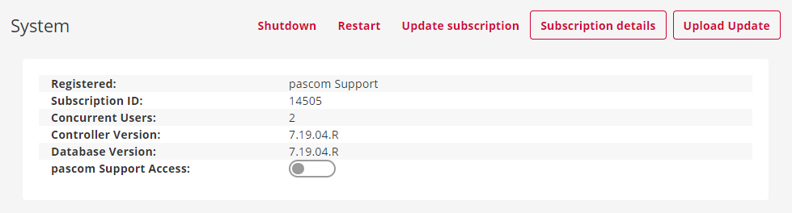





## Open up the Server Managament Interface and login

To access the server management interface, call up the management adress of your pascom system via your browser. This is made up of the IP or DNS Adress, followed by the management port.(**e.g. 10.1.3.2:8443 or mygreatpascom:8443**).

**Management-Port: 8443**

To login, use the data assigned in the setup wizard for your **Admin Account**.

- User: **admin**
- Password: **set by you**

## The Dashboard

On the dashboard of the pascom management interface you will find general information of the performance from the pascom appliance.

|Bezeichnung|Beschreibung|
|---|---|
|CPU| Shows the percentage utilization of the Linux kernel.   these are calculated from **user processes**, **high-priority processes**, **system resources** and the **idle state of the processor**.    More [Infos](https://de.wikipedia.org/wiki/Load#Prozentuale_Auslastungswerte_bei_Linux). |
|Memory| Shows how much RAM in total and how much of it is available and used.|
|Disk Space| Shows how much hard disk space in total and how much of it is available and used.|
|Phone Systems| Shows how many telephone instances are available on the pascom appliance and how many are currently running.|

## The phone systems

Here you will find a list of your telephone instances on the pascom appliance.

{}
If you are not a **pascom Cloud Service Partner**, only one telephone instance can be started **on the pascom host**.
{}

- via  you can create a new Phone Instance an the appliance.
- via  you will get to the **advanced settings**.

### Advanced Settings of the Phone System

To change settings on the telephone instance, these must first be stopped.

{}
Stop the telephone system outside of your business hours, because the system is not available during this time.
{}

Click the  button to stop the telephone system.

Then click on .

**Here you can now make some settings on your telephone instance:**

- **Auto-Start**: Determine whether this telephone system should start automatically when the appliance is switched on.
- **Web-CLI**: Set the access to the Web CLI. 
- **VPN Access**: Activate / deactivate access to the telephone system via VPN.
- **Time Zone**: Set the time zone of the telephone system.
- **System Language**: Change the language of the telephone instance here. 

### Backups

You can find detailed instructions on the subject of **backup and restore** [here]().

## The Interfaces

In the interface menu you have an overview of the existing Ethernet interfaces. In addition to the name of the interface and some data on network addresses, the overview shows you whether a network interface is started or stopped.
 

In addition, the small symbols **Management** and **SSH** show you via which interface you can access the **Server Management interface** and have **SSH** access.

Use the following data for **SSH access**:
- User: **admin**  
- Password: **set by you**

With the button  you get to **advanced settings** of the corresponding interface.

### Advanced Settings of the Interface

In the advanced settings of the network interface, you determine how your pascom appliance can be reached and how the communication works

|Einstellung|Beschreibung|
|---|---|
|**enable DHCP**| Activate / Deactivate: Interface automatically receives network addresses from your DHCP server.|
|**DNS - FQDN**| Enter your DNS address here.|
|**IP-Adress, Netmask und Gateway**| If DHCP is deactivated, network addresses can be adjusted manually.|

 

|Einstellung|Beschreibung|
|---|---|
|**Redirection-URL**| Specify which telephone system is forwarded to when you call up your IP / DNS address.|
|**VPN-Proxy**| Activate / deactivate: OPENVPN connection via port 8885 is possible.|
|**Mobile Pairing**| Activate / deactivate: Allows you to pair mobile devices. This can be switched off globally.|
|**Certificate Mode**| Self Signed (**default**)   Lets Encrypt   or upload your own certificate.     Certify and secure your connection to the pascom system here.|
|**Secure Phone Provisioning**| Activate / deactivate: Provision your phones via **insecure** UDP / RTP or **secure** TLS / SRTP|
|**Allow local DHCP Provisioning**| Activate / deactivate: Use your own DHCP server for the provisioning of your end devices through the option66.|

 

|Einstellung|Beschreibung|
|---|---|
|**VoIP**| secure: TLS/SRTP    unsecure: UDP/RTP   deactivated: no voice possible.|
|**RTP Port From - To**| Specify here which ports, RTP connections (speech) should run.|
|**Allow Client (XMPP) Connections**| Activate / deactivate: Allow / deny use of the pascom client.|
|**Manage Phone System**| Set access to your telephone system via Http Web GUI and REST.|
|**Allow LDAP Connections**| Configure the LDAP connection.   secure (LDAPS), simple (LDAP) or deactivated.|
|**SIP ALG**| Activate / Deactivate: Influences / corrects the pascom SIP headers.|

 

|Einstellung|Beschreibung|
|---|---|
|**DHCP-Server**| Enable / Disable. Use the DHCP server of the pascom appliance|
|**DHCP-Mode**| Determine whether all DHCP requests should be answered or only from **supported phones**.|
|**DHCP-Range From - To**| Specify the IP range in which the DHCP server should assign IP addresses.|
|**Gateway and DNS**| Enter the corresponding addresses of your gateway and DNS here.|
|**Forward phone requests to this phone system**| Specify the telephone system in which the telephones are to be set up for automatic provisioning.|

## The System

In the system menu you will find some functions that directly affect the pascom host, such as control options and firmware updates.

- **Shutdown**: Shuts down the entire appliance so that it is safely switched off.
- **Restart**: Restarts the entire appliance. 
- **Upgrade Subscription**: Use this function to check whether your license is up to date.
- **Subscription details**: This button takes you to your MyPascom account.
- **Upload Update**: Use this button to import a new firmware / server version. 

## Firmwares

You can find detailed instructions on updates and firmwares [here]().
