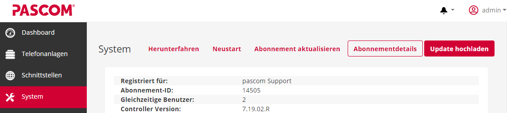
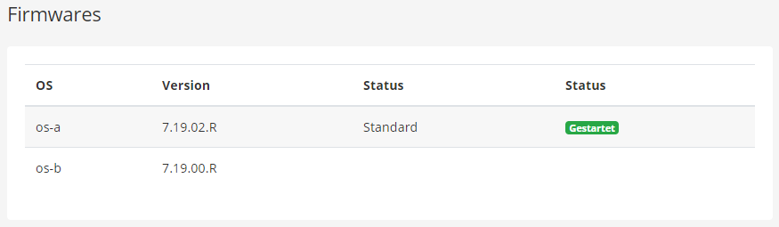
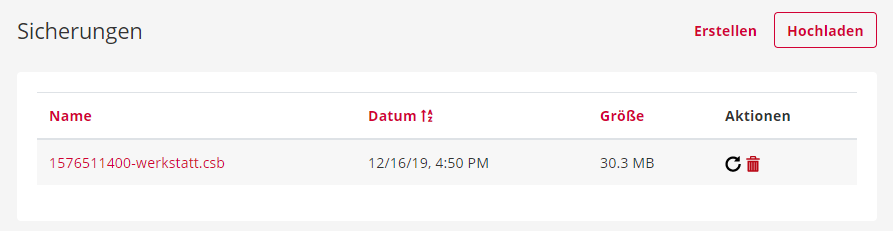





## Trainingsvideo



## System Updaten

{}
Cloud Anlagen werden bei einer neu verfügbaren Version automatisch in Serviceinteravallen geupdatet. Diese finden außerhalb der Geschäftszeiten in der Nacht statt.
{}

Wenn Sie bereits eine pascom 18 oder höher im Einsatz haben, sind für ein Update folgende Schritte notwendig.

### pascom ISO downloaden

Laden Sie sich die pascom Server [ISO-Datei](https://www.pascom.net/de/downloads/) der aktuellsten Version von der Download-Seite unserer Homepage herunter.

### pascom Update durchführen

Melden Sie sich am **pascom Server Management** an.

Klicken Sie unter dem Menüpunkt  auf den Button  und laden Sie dort die zuvor heruntergeladene pascom ISO-Datei hoch.

### pascom neustarten

{}
Während des Neustarts und Installationsvorgang der Telefonanlage, ist die Telefonie nicht möglich und alle laufenden Gespräche werden beendet. Führen Sie den Neustart daher nie im laufenden Betrieb aus.
{}

Die Installation des Updates wird erst bei einem Neustart der Telefonanlage durchgeführt.
Klicken Sie dazu auf  > 

Sobald das Update erfolgreich durchgeführt wurde, wird Ihnen der Host mit der neuen Server Version unter  >  aufgelistet.

### Die Firmwares | OS-A & OS-B

Die pascom Anlage verfügt über ein Firmware-Cluster-Modul, welches bei Updateproblemen ganz einfach zurück auf die vorherige Version schalten kann. Bei einem Update wird immer das OS gewält, welches gerade nicht gestartet ist. Bei einem erfolgreichen Update, wird die geupdatete OS Version automatisch gestartet und die vorherige beendet, welche dann für das nächste Update bereitsteht. 

**Was tun wenn ein Update fehlgeschlagen ist?**

1. Verbinden Sie Ihre Hardware Appliance mit einem Monitor + Tastertur. (Virtualisiert meist schon vorhanden)
2. Führen Sie einen Neustart unter  >  durch. 
3. Zu Beginn des Bootvorgang können Sie OS-A oder OS-B auswählen, welches dann geladen wird. 
4. Das Update können Sie dann ganz einfach erneut durchführen. 

## System Sichern
### Backup über die pascom Server Management Oberfläche (nur Onsite)
Auf der **pascom Server Management** Oberfläche gelangen Sie über  in die  Ihrer Telefoninstanz, wo Sie zunächst eine Übersicht Ihrer Backups finden.

1. Klicken Sie auf **Erstellen** und es wird ein komplettes Backup Ihres Systems generiert.
2. Verwalten Sie Ihre Backups, indem Sie die Sicherungen über den **Link** im Dateinamen, herunterladen oder über das **Mülleimer-Symbol** wieder entfernen. 

### Backup über die Admin-Weboberfläche

Sowohl Cloud als auch Onsite pascom Systeme haben die Möglichkeit, direkt über die Admin-Weboberfläche Sicherungen zu erstellen. Gehen Sie dazu unter  >  auf . Hier stehen Ihnen noch weitere Einstellungsmöglichkeiten zur Verfügung.   

1. Mittschnitte mit einbeziehen.
2. Empfangene Faxe mit sichern.
3. Voicemails einschließen.  
  

Sobald das Datenbankbackup abgeschlossen ist, erhalten Sie einen Link zum **Download** Ihrer **Sicherungsdatei**.

## System Wiederherstellen

{}
Sollten Sie Probleme mit der Größe Ihrer Backupdatei beim Wiedereinspielen auf der pascom Anlage haben, wenden Sie sich an unseren Support.
{}

### Wiederherstellung über die pascom Server Management Oberfläche (nur Onsite)
Auf der **pascom Server Management** Oberfläche gelangen Sie über  in die  Ihrer Telefoninstanz, wo Sie zunächst eine Übersicht Ihrer Backups finden.

1. Laden Sie eine Sicherung über den Button  auf das pascom System.

2. Alternativ können Sie aus Ihrer **Backup-Liste** über den schwarzen  - Button eine **Systemwiederherstellung** der entsprechenden Sicherung starten. 

### Wiederherstellung über die Admin-Weboberfläche

Sowohl Cloud als auch Onsite pascom Systeme haben die Möglichkeit, direkt über die Admin-Weboberfläche Sicherungen wieder einzuspielen. Gehen Sie dazu unter  >  auf .  
  

Wählen Sie Ihre **Backupdatei** über **Datei auswählen** und starten Sie den Wiederherstellungsprozess über den Button .

### Wiederherstellung über den Installations-Assistenten 

Bei der Einrichtung einer neuen pascom Telefonanlage können Sie mit Hilfe des Installations-Assistenten während dem Setup-Prozess Ihre vorhandene Datenbanksicherung einspielen. 

Klicken Sie dazu einfach auf den Button , laden Ihre Backupdatei hoch und den Rest erledigt der Installations-Assistent für Sie. 