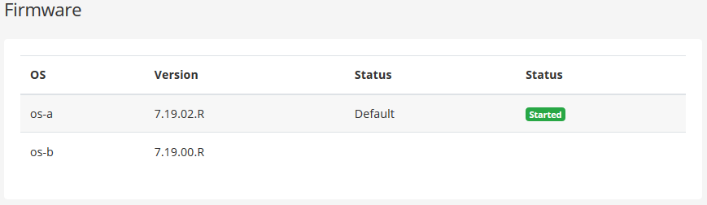
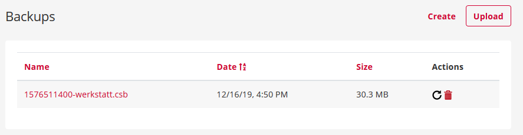





## Training Video



## Phone System Updates

{}
With a newly available version, cloud systems are automatically updated in service intervals. These take place outside of business hours at night.
{}

If you have already deployed a pascom 18 or newer phone system, the following steps are necessary when updating your phone system. 

## Download pascom ISO

Download the latest version of the pascom phone system server [ISO file](https://www.pascom.net/en/downloads/) from the downloads page on our website.

## Perform pascom Update

Log into the **pascom Server Management** UI.

Under the menu option  click the  button and upload the ISO file downloaded in the previous step.

## Restart pascom

{}
During the phone system restart and installation process, telephony services will not be available and all active calls will be disconnected. Therefore, never perform a system restart while the system is in use.
{}

The installation of updates is done only when the phone system has been restarted.
To perform a restart, click  > 

As soon as the update has successfully finished, the host with the new server version will be listed under  > .

### Firmwares | OS-A and OS-B

The pascom system has a firmware cluster module, which can easily switch back to the previous version in the case of update problems. During an update, the OS that is not currently started is selected. If the update is successful, the updated OS version is started automatically and the previous one is ended, which is then used for the next update.

**What to do if an update fails?**

1. Connect your hardware appliance to a monitor + keyboard. (Virtualized mostly already available)
2. Restart the whole System under  > .
3. At the beginning of the boot process you can select OS-A or OS-B, which will then be loaded.
4. You can then easily start the update again.

## System Backup
### Backup via the pascom Server Management Interface (Onsite only)

On the **pascom Server Management** interface, you can access the  of your telephone instance via , where you will first find an overview of your backups.

1. Click **Create** and a full backup of your system will be generated.
2. Manage your backups by downloading the backupfiles via the **link** in the file name, or removing them using the **trashcan symbol**.

### Backup via the Admin Web Interface

Both cloud and on-site pascom systems have the option of creating backups directly via the admin web interface. To do this, go to  >  on . There are other options available to you here.

1. Include Recordings
2. Include received Facsimiles
3. Include Voicemails  
  

As soon as the database backup is completed, you will receive a link to **download** your **backup file**.

## System Restore

{}
If you have problems with the size of your backup file when restoring it on the pascom system, please contact our support.
{}

### Restore via the pascom Server Management Interface (Onsite only)

On the **pascom Server Management** interface, you can access the  of your telephone instance via , where you will first find an overview of your backups.

1. Load a backup onto the pascom system using the  Button.  
  

2. Alternatively, you can start a **system restore** of the corresponding backup from your **backup list** using the black  Button.

### Restore via the Admin Web Interface

Both cloud and on-site pascom systems have the option of importing backups directly via the admin web interface. To do this, go to  >  and .  
  

Select your **backup file** via **select file** and start the recovery process with the button .

### Restore via the Installation-Wizard

When setting up a new pascom telephone system, you can use the installation wizard to import your existing database backup during the setup process.

Simply click on the  button, upload your backup file and the rest of the process will do the installation wizard for you.