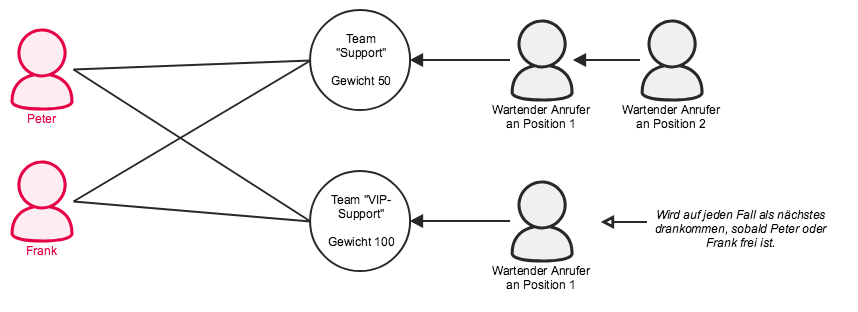





## Teamarten

Es gibt zwei verschiedene Arten von Teams die sich lediglich im Funktionsumfang unterscheiden.

### Rufgruppen

Rufgruppen haben **fix zugeteilte** Mitglieder und kennen nur die beiden Rufstrategien **alle** und **nacheinander**. Anrufer bekommen entweder ein Freizeichen oder Wartemusik vorgespielt.

### Warteschlangen

Warteschlangen können **fixe** und **dynamische Mitglieder** habe. Das bedeutet Benutzer können sich bei Bedarf an einer Warteschlange ad hoc anmelden. Außerdem kennen Warteschlangen eine **Vielzahl** verschiedener **Rufstrategien**.

Anrufer werden nacheinander in der Warteschlange **eingereiht** und bekommen auf Wunsch die **Warteposition** und **durchschnittliche Wartezeit** angesagt. Während der Wartezeit kann man entweder Wartemusik oder ein Freizeichen einspielen.

Warteschlangen können ein unterschiedliches Gewicht haben. Je höher die Gewichtung, desto wichtiger die Warteschlange.

## Warteschlangen erstellen

Zum Erstellen eines Teams klicken Sie in der Web-UI auf  > . Hier wählen Sie **Warteschlange** und geben Sie der Team einen Namen und eine Durchwahl und Klicken Sie auf .

Folgende Einstellungen sind nun möglich:

### Rufstrategien

|Strategie|Beschreibung|
|---|---|
|**alle anklingeln**|Alle Mitglieder werden gleichzeitig gerufen.|
|**nacheinander**|Die Mitglieder werden nach der Zuweisungsreihenfolge gerufen. **Achtung**: Dynamische Mitglieder verändern durch Ein- und Ausbuchen aus dem Team die Position.|
|**längste zurück**|Das Mitglied welches am längsten keinen Anruf entgegen genommen hat kommt als nächstes dran. **Achtung**: Dynamische Mitglieder setzten durch Ein- und Ausbuchen aus dem Team alle Zähler zurück und sind somit nach dem Einbuchen automatisch immer derjenige der am längsten keinen Anruf bekommen hat.|
|**wenigsten Anrufe**|Das Mitglied welches am wenigsten Anrufe angenommen hat kommt als nächstes dran. Diese Einstellung berücksichtig nicht die Anrufdauer. Wenn ein Mitglied beispielsweise 5 mal eine Minute lang telefoniert und ein anderes 2 mal eine Stunde ist trotzdem letzteres an der Reihe. **Achtung**: Dynamische Mitglieder setzten durch Ein- und Ausbuchen aus dem Team alle Zähler zurück und sind somit nach dem Einbuchen automatisch immer derjenige der am wenigsten Anruf bekommen hat.|
|**per Zufall**|Wählt zufällig einen Agenten aus.|
|**mem-nacheinander**|Wie nacheinander allerdings beginnt die Reihe beim nächsten Anrufer nicht von vorne sondern nach dem der als letztes einen Anruf entgegengenommen hat.|
|**per Zufall - gewichtet**|Wie per Zufall nur werden die Prioritäten der Agenten berücksichtigt. Erst wenn alle Agenten mit niedriger Priorität telefonieren werden die mit der nächst höheren gerufen.|

Wie Rufstrategien eingerichtet werden müssen erfahren Sie auf folgender Seite: [Rufstrategien]()

### Routing Skript

Hier kann ein Routing-Skript ausgewählt werden. Mehr dazu unter [Skill Based Routing]()

### Pickup-Benachrichtigungen

In einem Team ist es möglich einzustellen, welche Benutzer im pascom Client Pickup-Benachrichtigungen über eingehende Rufe erhalten.

Zuerst muss eine Pickup-Rolle definiert werden. Diese kann als Mitglieder ein Team haben und auch einzelne Benutzer, die nicht zum Team gehören. Informationen zu Rollen finden Sie unter Rollen.

Anschließend können Sie im Team, das zur angelegten Pickup-Rolle gehört festlegen wer Benachrichtigungen erhält.

Folgende Einstellungen sind möglich:

|Parameter|Bedeutung|
|---|---|
|**Niemand**|Niemand erhält Benachrichtigungen.|
|**Verfügbare Agenten und Nichtmitglieder**|Agenten die im Team angemeldet sind und Agenten die Nichtmitglieder im Team sind erhalten eine Benachrichtigung. Flexible Agenten die gerade nicht im Team angemeldet sind und pausierte Agenten erhalten keine Benachrichtigung.|
|**Nicht verfügbare Agenten und Nichtmitglieder**|Agenten die nicht im Team angemeldet sind, Agenten die pausiert sind und Nichtmitglieder des Teams erhalten eine Benachrichtigung. Agenten die feste Mitglieder des Teams sind und flexible Agenten die gerade angemeldet sind erhalten keine Benachrichtigungen.|
|**Nur Nichtmitglieder**|Nur Nichtmitglieder des Teams erhalten eine Benachrichtigung.|
|**Gesamte Pickup-Gruppe**|Die gesamte Pickup-Gruppe bekommt Benachrichtigungen.|

### Anzeigetext

Dieser Text wird dem Benutzer bei einem Anruf über das Team vor der Rufnummer des Anrufers angezeigt. Damit weiß das Team-Mitglied, dass der nicht direkt sondern über die Durchwahl des Teams angerufen wird.

### Wartemusik

Zur Auswahl stehen **Freizeichen** und **Wartemusik: "default"**. Möchten Sie eigene Wartemusik verwenden, lesen Sie den Artikel über [Wartemusik]().

### Timeouts

|Einstellung|Beschreibung|
|---|---|
|**Mitglied-Timeout**|Zeit in Sekunden, wie lange es bei einem Team-Mitglied klingeln soll.|
|**Timeout extern**|Zeit in Sekunden, wie lange es bei Anrufen von extern in der Warteschlange klingeln soll. Anschließend wird die Aktion Extern/Nachher ausgeführt.|
|**Timeout intern**|Zeit in Sekunden, wie lange es bei Anrufen von intern in der Warteschlange klingeln soll. Anschließend wird die Aktion Intern/Nachher ausgeführt.|
|**Timeout aus Label**|Label aus dem die Zeit in Sekunden, wie lange es bei Anrufen in der Warteschlange klingeln soll, augelesen wird. Anschließend wird die Aktion Intern/Nachher bzw. Extern/Nachher ausgeführt.|

### Einstellungen zu Anrufern

|Einstellung|Beschreibung|
|---|---|
|**Maximale Anzahl Wartende**|Anzahl der Anrufer die in der Warteschlange warten. Weitere Anrufer fallen in die Aktion Nachher.|
|**Betreten wenn leer**|Gibt an, ob ein Anrufer die Warteschlage betreten soll, falls kein Agent angemeldet ist.|
|**Verlassen wenn leer**|Gibt an, ob ein Anrufer die Warteschlage verlassen soll, falls sich der letzte Agent abmeldet.|
|**Priorität aus Label**|Die Priorität des Anrufers wird aus dem angegebenen Label ausgelesen. Je nach Höhe der Priorität im Label wird der Anrufer in der Warteschlangenposition eingeordnet.|

### Voicemailbox

|Einstellung|Beschreibung|
|---|---|
|**Voicemail Pin**||
|**Voicemail speichern**|**JA** bedeutet, die Voicmails werden nach dem Versenden oder nachdem sie abgehört werden auf der pascom gespeichert bleiben. Durch einen Cronjob können ältere Voicemails gelöscht werden. **NEIN** bedeutet, dass die Voicemails nach dem Versenden per E-Mail von der pascom gelöscht werden. Diese Einstellung ist zu empfehlen, da Voicemails viel Speicherplatz verwenden.|
|**Voicemail Email**|An diese E-Mail-Adresse werden die Voicemails verschickt.|

### Gewichtung

Warteschlangen können ein unterschiedliches Gewicht haben. Je schwerer desto wichtiger. Als Gewicht können Sie eine beliebige Zahl eintragen.   
Ist ein Benutzer in mehreren Warteschlangen eingebucht erhält er bei zeitgleichen Anrufen zuerst den Anrufer aus der Warteschlange mit der höheren Gewichtung.

{}
Wenn Sie mit Gewichten arbeiten dürfen Sie keine Warteschlangen ohne Gewicht benutzen. Diese haben dann ein Gewicht von 0 und kommen somit nie an die Reihe.
{}

### Ansage-Frequenz

Tragen Sie hier ein in welchen Abständen (Sekunden) der Anrufer über seine Position und Wartezeit in der Warteschleife informiert werden soll. Lassen Sie dieses Feld leer wird der Anrufer keine derartigen Ansagen hören.

### Optionen

Hier können Sie alle Optionen eintragen die Asterisk für Warteschleifen kennt. Eine Option pro Zeile.
Siehe: [https://wiki.asterisk.org/wiki/display/AST/Using+queues.conf](https://wiki.asterisk.org/wiki/display/AST/Using+queues.conf)

### Call Completed Elsewhere senden

Alle Agenten in einem Team, sehen in Ihrem Journal eingegangene Team-Anrufe, auch die, die von einem anderen Team-Mitglied angenommen wurden. Diese Anrufe werden nicht als "verpasster Anruf", sondern als "Call Completed Elsewhere" angezeigt.

