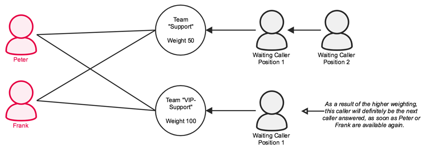





## Team Types

There are two different types of teams which offer differing functionality.

### Call Group

Call Groups *(Abbr: CG)* have **fixed assigned** members and only support the two call strategies **parallel** and **sequential** (ring all or one after the other). Callers are played either a ring tone or music on hold. 

### Call Queues

Call Queues *(Abbr: CQ)* support both **fixed** and **dynamic** members. This enables users to log in and out on an ad hoc basis according to requirements. Furthermore, Call Queues support a much **larger number** of **call strategies**.

Callers will be **placed in the queue** one after the other and if so required can be played **queue position** and **average waiting time** prompts. During the waiting time, it is possible to playback to callers either music on hold or a ringing tone.

Queues can have different weightings. The higher the weighting, the more important the queue.

## Create a Team

To create a team, navigate to the pascom phone system web UI and click  > . Now select the appropriate team type for your requirements: **Queue** or **Call Group** and enter a name and extension for the team before clicking .

The following settings are now available:

### Call Strategies

|Strategy|Description|CG|CQ|
|---|---|---|---|
|**aRing all**|With this call strategy, incoming team calls will be simultaneously signalled to all active team members. *This is the default setting.*|<i class="fas fa-check"></i>|<i class="fas fa-check"></i>|
|**One after another**|With this call strategy, all members will be called according the order in which they were assigned to the team.   The ring duration of a call is defined using the "Member Timeout" setting.  **Warning**: The logging in and out of flexible / dynamic team members changes team positions, therefore it is recommended to log in all members as static members and to use pause reasons instead of dynamic members.|<i class="fas fa-check"></i>|<i class="fas fa-check"></i>|
|**Longest back**|With this call strategy, incoming calls will first be routed to the team member who has not taken a call for the longest period of time. **Warning**: flexible members reset all counters when they log in and out and when they log in are automatically set as the member who has not taken a call for the longest period of time. We recommend using pause reasons instead as these do not reset any time counters. |<i class="fas fa-times"></i>|<i class="fas fa-check"></i>|
|**Fewest calls**|With this call strategy, incoming calls will first be routed to the team member who has taken the fewest number of calls.  This setting does not consider the duration of a call. Should a member receive 5 calls lasting one minute, a member who has received 2 calls lasting an hour each will receive the next call.  **Warning**: flexible members reset all counters when they log in and out and when they log in are automatically set as the member with the fewest calls. We recommend using pause reasons instead as these do not reset any time counters.|<i class="fas fa-times"></i>|<i class="fas fa-check"></i>|
|**Randomly**|With this call strategy, incoming calls are routed randomly to team members. |<i class="fas fa-times"></i>|<i class="fas fa-check"></i>|
|**Mem-successively**|With this call strategy, all members will be called according to the order in which they were assigned. After a received call, the next call will be routed not to the first member on list but rather to the member after the member who took the last call.  The ring duration of a call is defined using the "Member Timeout" setting.  **Warning**: flexible members reset all counters when they log in and out and therefore we recommend using pause reasons instead as these do not reset any time counters.|<i class="fas fa-times"></i>|<i class="fas fa-check"></i>|
|**Mem-successively - sorted**|With this call strategy, all members will be called according to the order in which they were assigned. After a received call, the next call will be routed not to the first member on list but rather to the member after the member who took the last call.  The ring duration of a call is defined using the "Member Timeout" setting.  Flexible members do not affect the position in the team when they log in and out. |<i class="fas fa-times"></i>|<i class="fas fa-check"></i>|
|**Randomly - weighted**|With this call strategy, all incoming calls will be randomly routed to team members, however consider priority weightings - it is still random which agent will receive the call. As such an agent with a lower priority value only has a higher probability of being called than an agent with a higher priority weighting. |<i class="fas fa-times"></i>|<i class="fas fa-check"></i>|

### Routing Script

Here you can select a routing script. More information is available under [Skills Based Routing]()

### Pickup Notifications

In a team it is possible to set which users receive inbound call pickup notifications via the pascom client. 

The following settings are now available:

|Parameter|Description|
|---|---|
|**No one**|No one will receive pop up notifications.|
|**Available agents and non-members**|Agents who are logged into the team and agents who are not team members within the team will receive notifications. Flexible / dynamic agents who are currently not logged in and paused agents will not  received any notifications.|
|**Non-available agents and non-members**|Agents who are not logged into the team, agents who are paused and non-members of a team will receive a notification. Agents who are static team members and flexible agents currently logged into the team will not receive any notifications.|
|**Only non-members**|Only non-members of a team will receive a notification.|
|**Whole pickup group**|The whole pickup group will receive a notification. For this purpose, a [Pickup role]() must first be defined.|

### Display Text

Text to be displayed to users for inbound team calls and is displayed before the callers number. As such the team members know that they have been called via the team and not directly.

### Music on Hold

Options include **dial tone** (ringing tone) and **Music on Hold: "default"**. Should you wish to use your own music on hold, please read the article on [Music on Hold]().

### Timeouts

|Setting|Description|
|---|---|
|**Member-timeout**|Time in seconds that a call should ring by a team member.|
|**Timeout external**|Time in seconds that an external call should ring in the queue. After this period, the actions External/After will be performed.|
|**Timeout internal**|Time in seconds that an internal call should ring in the queue. After this period, the actions Internal/After will be performed.|
|**Timeout from label**|Label from which the queue call ring time in seconds should be read. After this period, the actions Internal/ After or External/After will be performed.|

### Caller Settings

|Setting|Description|
|---|---|
|**Maximum number of people waiting**|Maximum number of permitted waiting callers in the queue. Further callers will be handled according to the actions Internal or External/After.|
|**Join if no agents (empty)**|Determines of whether or not a caller can enter the queue should no agents be logged on.|
|**Leave if no agents (empty)**|Determines of whether or not a caller should leave the queue if no agents are logged on.|
|**Priority from label**|The priority of the caller will be read from the specified label. The caller will be positioned in the queue according the priority level specified in the label.|

### Voicemail

|Setting|Description|
|---|---|
|**Voicemail Pin**||
|**Save Voicemails**|**YES** will save all voicemails to the pascom phone system even once they have been sent and / or listened to. By using a Cronjob, old voicemails can be deleted. **No** will delete the voicemail from the pascom phone system once they have been sent. This setting is recommended as voicemails require significant storage space.|
|**Voicemail e-mail**|The e-mail address to which voicemails should be sent. |

### Weighting

Queues can be assigned differing weightings. The higher the weighting the more important the queue. Any number can be entered as a queue weight.  
Should a user be a member of and logged into multiple queues and two calls arrive simultaneously, they will receive the call from the queue with the higher weighting. 

{}
Should you work with weightings, you can not use any queues without an assigned weighting. Such queues will be assigned a weighting of 0 and therefore calls to this queue will never come to the fore.
{}

### Prompt Frequency

Enter the interval frequency (in seconds) in which the caller should be informed of their position and expected waiting time in queue. If the field is left blank, the caller will not hear any prompts of this type. 

### Options

Here it is possible to enter all options supported by Asterisk queues. Please only enter one option per line.
For more information, please refer to: [https://wiki.asterisk.org/wiki/display/AST/Using+queues.conf](https://wiki.asterisk.org/wiki/display/AST/Using+queues.conf)

### Send Call Completed Elsewhere Information

Within their call history, all team agents can see all inbound team calls, even those answered by other team members. This call will not be marked as a "missed call" but rather as a "Call Completed Elsewhere".

