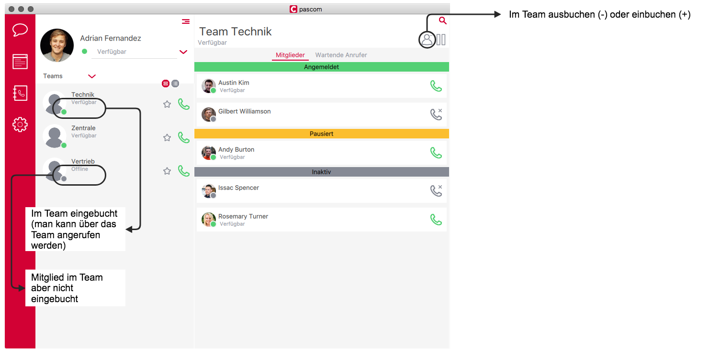
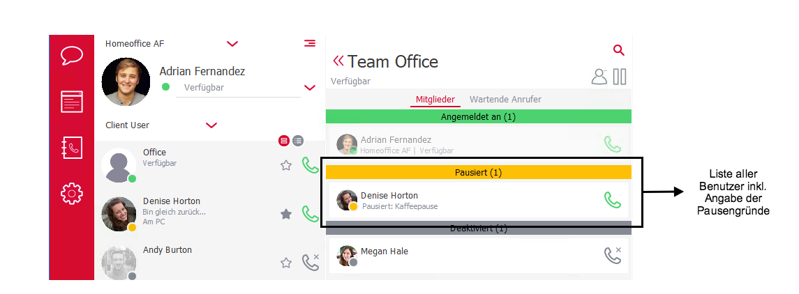
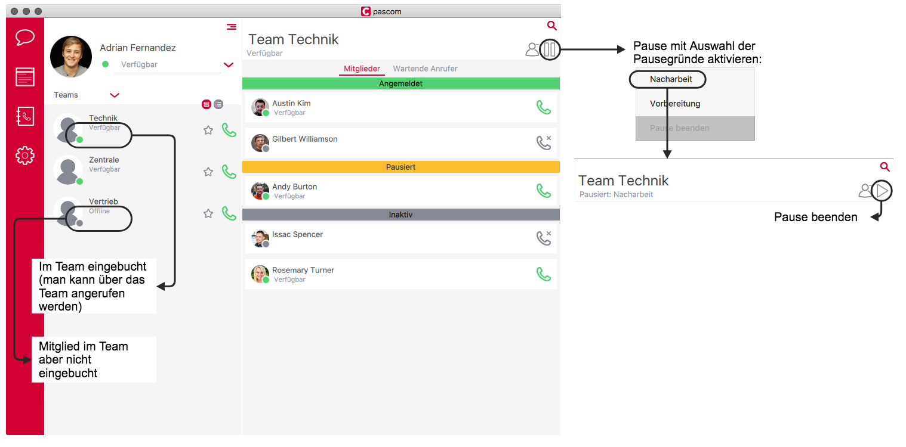





## Mitglieder zuweisen

In diesem Tab können Mitglieder zur Warteschlage hinzugefügt werden. Klicken Sie auf den blauen Pfeil in Richtung rechts um einen Benutzer zuzuweisen. Möchten Sie den Benutzer aus dem Team entfernen, klicken Sie auf den Pfeil in Richtung links.

### Flexible Mitglieder

Wie bereits erwähnt können Benutzer feste oder flexible Agenten in einer Warteschlange sein. Per default ist ein Agent nicht flexibel. Dies können Sie ändern mit einem Klick auf das *Flexibel*-Feld. Wählen Sie *Ja*.  

#### Ein-/ Ausbuchen am pascom Client

Wenn Sie Teams mit einer entsprechenden [Rolle im pascom Client sichtbar]() gemacht haben, können sich diese Benutzer direkt am pascom Client im Team ein- und ausbuchen.

Dazu öffnen Sie im pascom Client die Team Anzeige und melden sich durch das + und - Symbol an einem Warteschlangen Team an- und abmelden.

#### Ein-/ Ausbuchen mit Funktionscodes

Damit sich flexible Agenten in die Warteschlagen einbuchen können benötigen Sie einen Einbuchcode. Dieser kann im Tab  definiert werden.

{}
Verwendet der Benutzer ein IP-Telefon, kann eine LED-Nebenstellentaste (meistens Typ BLF) mit dem Einbuchcode konfiguriert werden. Lesen Sie dazu die Herstellerspezifikation Ihres [IP-Telefons]().
{}

*Beispiel:* 
Der Einbuchcode lautet **\*90** und der Agent hat die Durchwahl **13**. Der Agent muss dabei **\*9013**  wählen um sich in der Warteschlagen anzumelden. Zum Abmelden muss ebenfalls **\*9013** gewählt werden. Beim An- oder Abmelden hört der Agent jeweils eine Meldung über den nun aktuellen Status.

{}
Damit der Einbuchcode von der pascom richtig erkannt und bearbeitet wird, muss die pascom wissen, wie viele Stellen eine Benutzerduchwahl hat. Dies muss in den Systemeinstellungen festgelegt werden. Suchen Sie in dem Suchfeld nach *sys.asterisk.dialplan.global.alias.digit.value*. Der Defaultwert ist hier *3*. Passen Sie das entsprechend an. 
Wir raten davon ab, bei Benutzern Durchwahlen zu verwenden mit unterschiedlichen Druchwahlstellen.
{}

Mit den von Asterisk zur Verfügung gestellten [Funktionscodes]() kann der Benutzer das Ein- und Ausbuchen in Teams mit **\*99** auch ohne bekannten Einbuchcode steuern.

### Pausieren und Pausegründe

Statt sich an- und abzumelden ist es auch möglich als Mitglied einer Warteschlange zu pausieren. In dieser Zeit bleiben Sie an der Warteschlange angemeldet erhalten aber keine Anrufe.  
Pausegründe können unter  >  einstellt werden.

|Parameter|Beschreibung|
|---|---|
|**Bezeichung**|Die Bezeichnung wird im pascom Client als Pausengrund angezeigt.|
|**Kennung**|Mit der Kennung kann man die Pause pro Mitglied am Telefon-Tastenfeld aktivieren/deaktivieren.|

#### Pausieren im pascom Client

Wenn Sie Teams mit einer entsprechenden [Rolle im pascom Client sichtbar]() gemacht haben, können diese Benutzer direkt am pascom Client in der Team-Ansicht pausieren.

Pausiert ein Mitglied in der Warteschleife kann das von den anderen Mitgliedern inkl. Pausengrund im pascom Client gesehen werden:

Das Pausieren kann im pascom Client in der Team Anzeige durch das Pausensymbol gesteuert werden:

#### Pausieren mit Funktionscodes

Dank der Pausengrund-Kennung kann der Benutzer auch mit Hilfe von Funktionscodes pausieren.

Mit den von Asterisk zur Verfügung gestellten [Funktionscodes]() kann der Benutzer das Pausieren in Teams mit **\*99** steuern. 

{}
Verwendet der Benutzer ein IP-Telefon, kann eine LED-Nebenstellentaste (meistens Typ BLF) mit dem Einbuchcode konfiguriert werden. Lesen Sie dazu die Herstellerspezifikation Ihres [IP-Telefons]().
{}

*Beispiel:* 
Warteschlangen-Durchwahl: 100 
Benutzerdurchwahl: 13 
Kennung: 111 
Somit kann die Pause aktiviert/deaktiviert werden mit: **\*99100#13#111**

