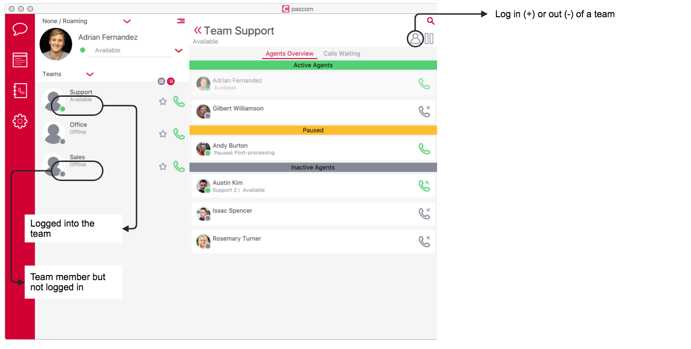
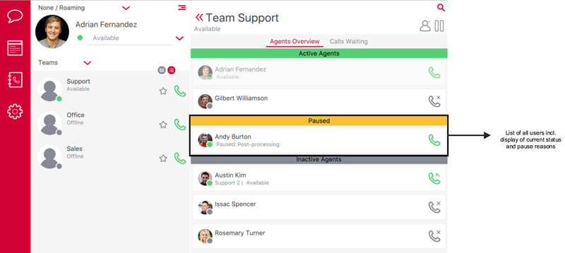
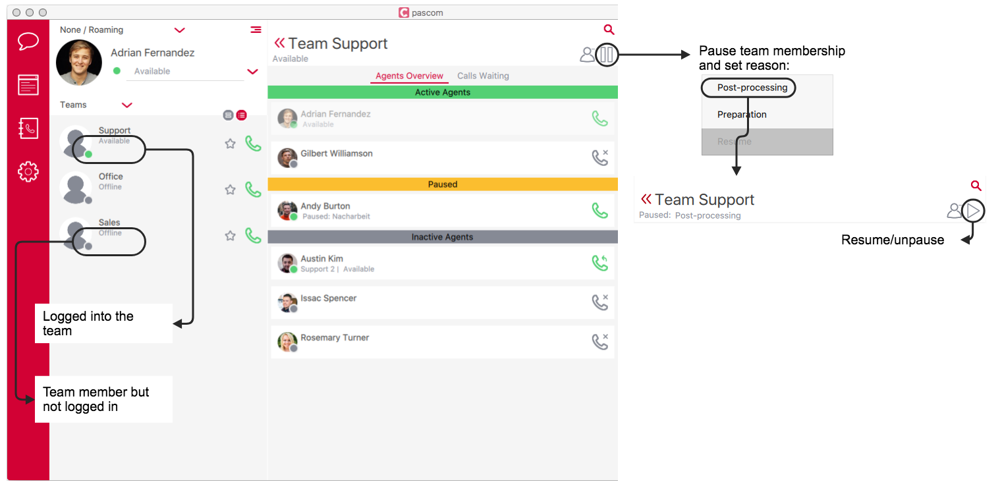





## Assign Members

Under the members tab, users can be assigned as team members. Use the blue arrow (pointing right) to assign a user. Should you wish to remove the user from the team, click on the blue arrow pointing left. 

### Dynamic Members

As already mentioned, users can be assigned to a team as static (permanent) or dynamic flexible members. Per default, members are added to the team as static agents. To turn an agent into a dynamic member, double click on the option in the *Dynamic coloumn* and select *Yes*.

#### Logging In / Out Using the pascom Client

If you have already made your teams visible in the pascom client by [using the corresponding role](), these users will have the ability to dynamically log themselves in and out of the team using the pascom UC client.

To do this, within the pascom client open the Teams Overview, select the desired team (if multiple teams) and by using the + and - symbols it is possible to log into or out of a team.

#### Logging In / Out Using Function Codes

To enable dynamic agents to log in to a queue, you will need a login code. This can be defined under the  tab.

{}
If a user uses an IP phone, it is possible to assign the login code to one of the phone's LED extension (BLF) keys (normally type BLF). Please refer to [IP Telephone]() manufacturer specifications for further information.
{}

*Example:* 
The login code has been set to **\*90** and the agent has the extension **13**. Therefore, the agent must dial **\*9013** from their desktop phone in order to login into the queue. Dialling **\*9013** again will log the agent out of the team. When logging in and out, the agent will hear a prompt with actual team membership status (Logged in or out).

{}
In order to login codes to be correctly recognised and processed by your pascom phone system, the phone system must the digit length of user extensions. This must be configured in the system settings. Using the search box in the pascom web UI, search for *sys.asterisk.dialplan.global.alias.digit.value*. The default value is set to *3* but can be modified to match your requirements accordingly. 
We recommend against using user extensions with varying lengths (number of digits).
{}

Using the available from Asterisk [Function Codes](), it is possible for a user to log in and out of teams using the function code **\*99** without needing the login code.

### Pausing and Pause Reasons

Instead of logging in and out of teams, it is also possible for members to pause their team membership. Whilst paused, the agent will remain a member of the team, but will not receive any calls.  
Pause Reasons can be set under  > .

|Parameter|Description|
|---|---|
|**Title**|The title will be display in the pascom client as the pause reason.|
|**Code**|Using this code, it is possible for team members to activate / deactivate the pause using their telephone keypad.|

#### Pausing in the pascom Client

If you have made your teams visible in the pascom client using the [corresponding role](), these users will have the ability to pause their team membership using the pascom UC client.

Should a member pause their membership of a queue, this and the reason for the pause can be seen in the pascom client by the other members:

The reason for the pause can also be controlled by using the pause symbol in the team section of the pascom client:

#### Pausing using Function Codes

Thanks to pause reason recognition, it is also possible for a user to pause themselves using function codes.

Using the available from Asterisk [Function Codes](), it is possible for a user to pause themselves using the function code **\*99**.

{}
If a user uses an IP phone, it is possible to assign the pause code to one of the phone's LED extension (BLF) keys (normally type BLF). Please refer to [IP Telephone]() manufacturer specifications for further information.
{}

*Example:* 
Queue Extension: 100 
User Extension: 13 
Code: 111 

To acitvate / deactivate a pause, the agent needs to dial:   **\*99{team}#{extension}#{pausecode}**   which translates to:  **\*99100#13#111** 

