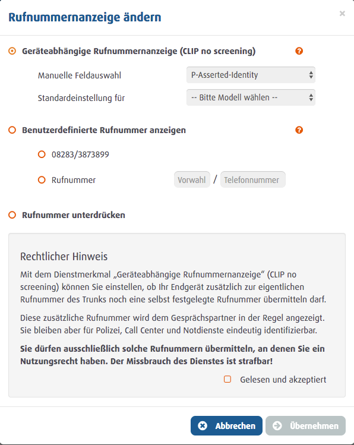



## Problem

You have successfully set up your Easybell SIP Account with the official Trunk Template in the pascom System. But the number
signaling of your Phonenumber does not yet work according to your requirements. In most cases, you still have to activate or 
configure the feature to use it with the pascom telephone system. 

# Solution

The Clip no screening feature includes a few settings that you have to make directly with Easybell. 

First, log in to the Easybell Control Center with your account data. 

1. Go to the **Change Number Display** menue.
2. Set the caller ID to **Device-dependent Caller ID**.
3. Set the **manual field selection** to **P-Asserted-Identity**
4. Finally, click on **apply**.  
 

