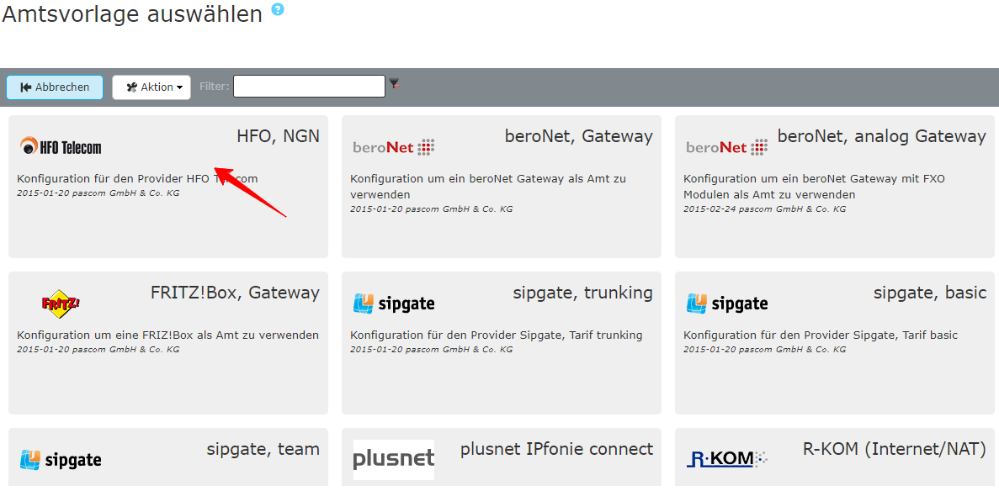





## Übersicht

Tarif in Kombination mit pascom: **Alle angebotenen Tarife**  

Informationen über Leistungsmerkmale und Tarife finden Sie hier: [HFO Telecom](http://www.hfo-telecom.de/ "HFO Telecom SIP Provider").



Für die Einrichtung eines SIP-Amtes über ein pascom Provider Template benötigen Sie die Zugangsdaten von Ihrem Provider. 

Die Zugangsdaten für Ihren SIP Trunk Account erhalten Sie von Ihrem Provider per Post oder sind online einsehbar im Kundenportal.

**Beispiel**

 



Fügen Sie ein neues Amt ein unter  >  > . Sie gelangen nun zur Ämter-Datenbank. Über den Filter können Sie direkt nach *HFO* suchen. Wählen Sie die Vorlage *HFO NGN* und befüllen Sie die Vorlage mit den erhaltenen Account-Daten.

 

 

**Befüllen Sie die Amtsvorlage**  

|Variable|Beschreibung|
|---|---|
|**Bezeichnung**|Geben Sie Ihrem Amt einen Namen, dieser erscheint in der Ämterliste.|
|**Telefonie-Benutzername**|Entnehmen Sie den Telefonie-Benutzernamen aus Ihren Zugangsdaten.|
|**Telefonie-Passwort**|Tragen Sie hier das dazu gehörige Telefonie-Passwort ein.|
|**Registrierungsrufnummer**|Entnehmen Sie die Registrierungsrufnummer aus Ihren Zugangsdaten.|
|**Ortskennzahl**|Tragen Sie die Ortskennzahl bzw. Ortsvorwahl ohne führende 0 ein. In unserem Beispiel *991*.|
|**Stammnummer**|Basisnummer des Telefonanschlusses ohne Nebenstellen. In unserem Beispiel als *XXXXXX* dargestellt.|
|**Präfix eing. Nummer**|Ist eine beliebige Ziffer, die bei eingehenden Telefonanrufen über dieses Amt vorangestellt wird. Wenn Sie hier eine 0 eingeben erscheint beispielsweise in der Anruferliste von IP-Telefonen dann nicht die 0172123123 sondern die 00172123123. Dadurch können Sie direkt aus der Anruferliste wieder über das selbe Amt zurückrufen.|
|**Anzahl der Durchwahlstellen**|Anzahl der Stellen der Benutzer-Durchwahlen. (NICHT die Anzahl der Nummern im Rufnummernblock!)|
|**Durchwahl Zentrale**|Geben Sie hier an, auf welche interne Durchwahl die erste Nummer Ihres Rufnummernblocks (meistens die 0) abgeworfen werden soll.|

 

### Beispiel

Nach dem  wird das Amt angelegt. 



Um sicher zu gehen ob Ihre Daten korrekt eingegeben wurden und ob sich die pascom Telefonanlage erfolgreich beim Provider registriert hat, klicken Sie unter  -  auf das  bei Ihrem Amt.
Hier sehen Sie ob die **Registrierung** geklappt hat. (*registered*).



Für die Onsite Telefonie wird für diesen Provider der pascom Outbound Proxy benötigt. In den  finden Sie die Einstellung , für welche der **Outbound Proxy** aktiviert werden soll.



Das Amt ist eingerichtet und erfolgreich registriert. Als letzten Schritt definieren Sie Ihre eingehenden und ausgehenden Rufregeln um das Anrufverhalten Ihrer pascom Telefonanlage einzustellen. 

Das Einrichten von Rufregeln erklären wir Ihnen in der Anleitung zu den [Rufregeln]()