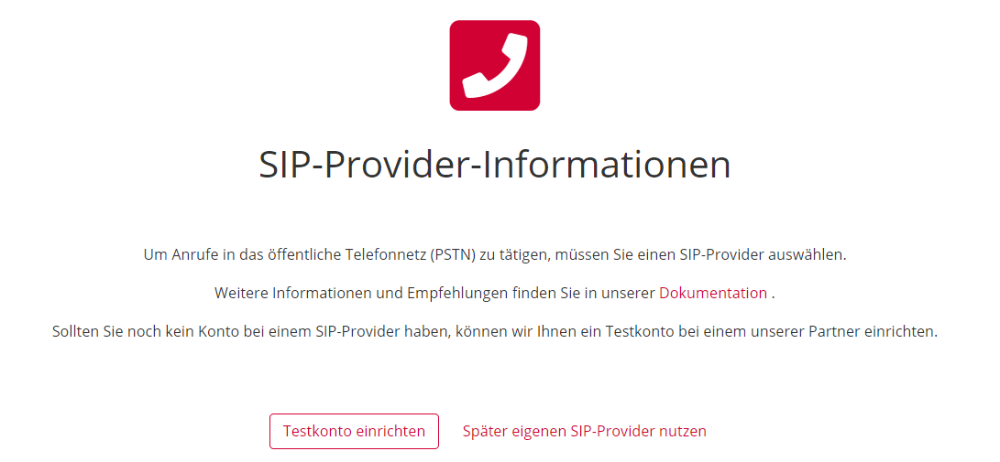
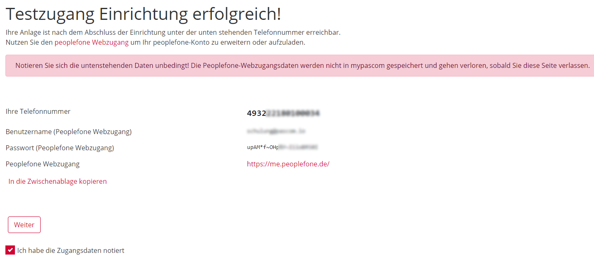
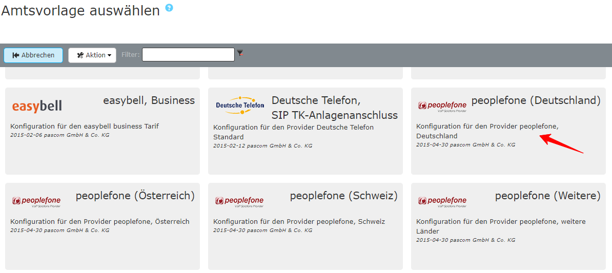





## Übersicht

Tarif in Kombination mit pascom: **Alle angebotenen Tarife**  

Informationen über Leistungsmerkmale und Tarife finden Sie hier: [Peoplefone](https://www.peoplefone.de/de/geschaeftskunden).



Für die Einrichtung eines SIP-Amtes über ein pascom Provider Template benötigen Sie die Zugangsdaten von Ihrem Provider. 

Die Zugangsdaten für Ihren SIP Trunk Account erhalten Sie von Ihrem Provider per Post oder sind online einsehbar im Kundenportal.

**Beispiel**

 

## Peoplefone Test Trunk nutzen

Bei der Einrichtung einer neuen pascom Telefonanlage können Sie während dem Setup einen kostenlosen Test SIP-Trunk von Peoplefone mit einrichten. Dieser Testaccount wird automatisch auf der pascom Telefonanlage eingerichtet und kann sofort genutzt werden.

**Testguthaben**: 10,-€
**Testrufnummer**: Wird dynamisch erstellt
**Test-Account kann ganz einfach im Peoplefone Kundenportal upgegradet werden**

Wählen Sie im Setup den Punkt **Testkonto einrichten**

Füllen Sie anschließend die vordefinierten Felder zu Ihrer Person/Unternehmen aus und akzeptieren Sie die AGB von Peoplefone. Herzlichen Glückwunsch! Der Peoplefon Test Trunk ist erstellt und kann auf der pascom Telefonanlage genutzt werden. 

**Notieren Sie sich die Daten des Peoplefon Test Trunk!**



Fügen Sie ein neues Amt ein unter  >  > . Sie gelangen nun zur Ämter-Datenbank. Über den Filter können Sie direkt nach *Peoplefone* suchen. Wählen Sie die Vorlage *Peoplefone* und befüllen Sie die Vorlage mit den erhaltenen Account-Daten.

 

 

**Befüllen Sie die Amtsvorlage**  

|Variable|Beschreibung|
|---|---|
|**Bezeichnung**|Geben Sie Ihrem Amt einen Namen, dieser erscheint in der Ämterliste.|
|**Telefonie-Benutzername**|Entnehmen Sie den Telefonie-Benutzernamen aus Ihren Zugangsdaten.|
|**Telefonie-Passwort**|Tragen Sie hier das dazu gehörige Telefonie-Passwort ein.|
|**Registrierungsrufnummer**|Entnehmen Sie die Registrierungsrufnummer aus Ihren Zugangsdaten.|
|**Ortskennzahl**|Tragen Sie die Ortskennzahl bzw. Ortsvorwahl ohne führende 0 ein. In unserem Beispiel *991*.|
|**Stammnummer**|Basisnummer des Telefonanschlusses ohne Nebenstellen. In unserem Beispiel als *XXXXXX* dargestellt.|
|**Präfix eing. Nummer**|Ist eine beliebige Ziffer, die bei eingehenden Telefonanrufen über dieses Amt vorangestellt wird. Wenn Sie hier eine 0 eingeben erscheint beispielsweise in der Anruferliste von IP-Telefonen dann nicht die 0172123123 sondern die 00172123123. Dadurch können Sie direkt aus der Anruferliste wieder über das selbe Amt zurückrufen.|
|**Anzahl der Durchwahlstellen**|Anzahl der Stellen der Benutzer-Durchwahlen. (NICHT die Anzahl der Nummern im Rufnummernblock!)|
|**Durchwahl Zentrale**|Geben Sie hier an, auf welche interne Durchwahl die erste Nummer Ihres Rufnummernblocks (meistens die 0) abgeworfen werden soll.|

 

### Beispiel

Nach dem  wird das Amt angelegt. 



Um sicher zu gehen ob Ihre Daten korrekt eingegeben wurden und ob sich die pascom Telefonanlage erfolgreich beim Provider registriert hat, klicken Sie unter  -  auf das  bei Ihrem Amt.
Hier sehen Sie ob die **Registrierung** geklappt hat. (*registered*).



Das Amt ist eingerichtet und erfolgreich registriert. Als letzten Schritt definieren Sie Ihre eingehenden und ausgehenden Rufregeln um das Anrufverhalten Ihrer pascom Telefonanlage einzustellen. 

Das Einrichten von Rufregeln erklären wir Ihnen in der Anleitung zu den [Rufregeln]()

