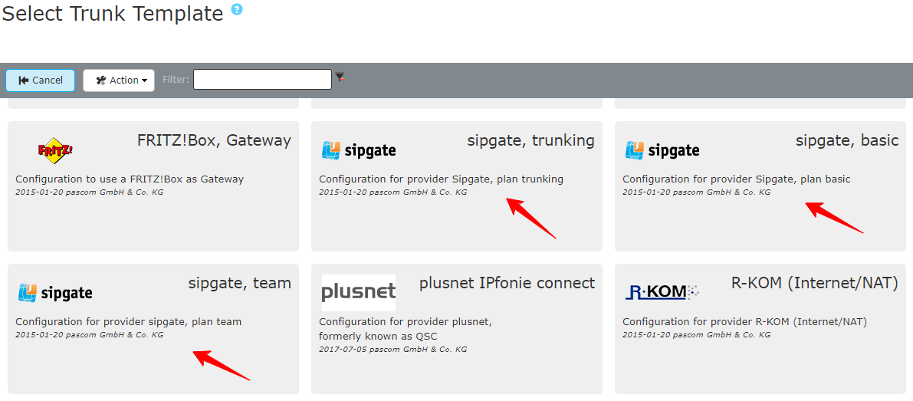





## Overview

Tariff in combination with pascom: **Sipgate Basic, Trunking and Team**

Information about features and tariff informations can be found here: [Sipgate](https://www.sipgatetrunking.de/).



To set up a SIP Trunk via a pascom Provider Template, you need the SIP Account data from your provider. 

You will receive the account data for your SIP trunk account from your provider by mail or can be viewed online in a customer portal.

**Example**

 



### Completing the Trunk Template

Add a new SIP trunk under  >  > , which directs you the the SIP provider database. Using the filter, you can search directly for *Sipgate* templates. Select one of the *Sipgate* templates and add your account data / credentials to the template setup wizard.

 

 

**Fill in the Variables**

|Variable|Description|
|---|---|
|**Name**|Enter a name for the trunk, which will be displayed in the Trunks overview.|
|**Telephony username**|Use the telephony username from your registration data.|
|**Telephony password**|Enter the corresponding password.|
|**Number of registration**|Registration phone number (Registrierungsrufnummer) as found in the registration data.|
|**Area code**|Enter your area code (Ortskennzahl / Ortsvorwahl) excluding the leading 0, e.g. *991*.|
|**Originating number**|Telephony connection base / line number (Stammnummer) excluding extension number block e.g. the number displayed as *XXXXXX* in our example.|
|**Prefix for incoming number**|Any digit which should precede all incoming calls via this trunk. For example entering 0 will mean that all inbound call numbers will be displayed in the call logs on IP Phones as 00172123123 instead of 0172123123. This enables the direct call back from the call history via this trunk.|
|**Number of extension digits**|The digit length of User Extensions - NOT the number of digits in the number block|
|**Extension for central**|Enter the internal extension number to which calls to the first number of your number block (normally 0) should be routed, i.e. to the switchboard / reception / AutoAttendant.|

### Example

After pressing  the trunk will be added. 



To make sure that your data has been entered correctly and that the pascom PBX has successfully registered with your provider, click on the  -  on the  at your trunk.
Here you can see if the **registration** has worked. (*registered*).



For onsite telephony, the pascom Outbound Proxy is required for this provider. In the  you will find the setting  for which the **Outbound Proxy** should be activated.



The trunnk is established and successfully registered. As a final step, you define your incoming and outgoing call rules to set the call behavior of your pascom telephone system. 

We explain how to set up call rules in the [Call Rules Tutorial]()

