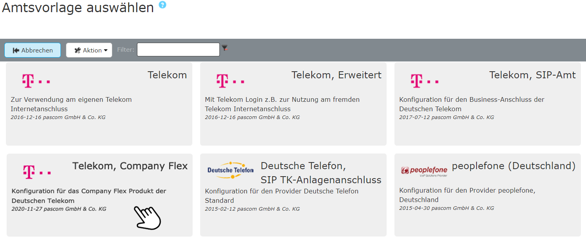





## Übersicht

Tarif in Kombination mit pascom: **Company Flex**  

{}
**Telekom Company Flex SIP Trunk** ist aktuell nur mit pascom 19.13 BETA verfügbar.
{}

Informationen über Leistungsmerkmale und Tarife finden Sie [hier](https://geschaeftskunden.telekom.de/internet-dsl/tarife/festnetz-internet-dsl/companyflex). Die [pascom Telefonanlage](https://www.pascom.net/de/voip-telefonanlage/ "pascom VoIP-Telefonagen Software") (sowohl Onsite als auch Cloud) unterstützt nur Business-SIP-Trunk Anschlüsse der Telekom.



Nach dem Erwerb und der Freischaltung Ihres Telekom Produkts erhalten Sie Account-Daten die wie folgt aussehen können:

**Telekom Company Flex**

Hat **eine** Registrierungsrufnummer +  Flex-ID für die Registrierung.

### SIP Trunk erstellen im Company Flex Tarif

Die Basis für einen Company Flex Account ist ein SIP Trunk. Ob nun eine Einzelrufnummer oder ein Durchwahlbereich definiert ist, spielt keine Rolle.

Loggen Sie sich in das [Business Service Portal](https://bsp.t-mobile.de/portal/) ein und **selektieren** Sie Ihren Company Flex Vertrag. Anschließen wählen Sie im **Drop-Down** den Eintrag **Company Flex konfigurieren** und klicken auf **weiter**.

Im nächsten Menü wählen Sie den Punkt **Sip Trunk** anlegen und erstellen sich für Ihren Company Flex Tarif einen Sip Trunk.



### Amtsvorlage verwenden

Fügen Sie ein neues Telekom-Amt ein unter  >  > . Sie gelangen nun zur Ämter-Datenbank. Über den Filter können Sie direkt nach *Telekom* suchen. Wählen Sie die Vorlage *Telekom Company Flex* und befüllen Sie die Vorlage mit den erhaltenen Account-Daten.

 

 

**Befüllen Sie die Amtsvorlage**  

|Variable|Beschreibung|
|---|---|
|**Bezeichnung**|Geben Sie Ihrem Amt einen Namen, dieser erscheint in der Ämterliste.|
|**Zugangsnummer - Flex ID**|Entnehmen Sie die Flex ID aus Ihren Zugangsdaten.|
|**Passwort**|Tragen Sie hier das dazu gehörige Telefonie-Passwort ein.|
|**Registrierungsrufnummer**|Entnehmen Sie die Registrierungsrufnummer aus Ihren Zugangsdaten.|
|**Rufnummer**|Basisnummer des Telefonanschlusses ohne Nebenstellen.|
|**Präfix eing. Nummer**|Ist eine beliebige Ziffer, die bei eingehenden Telefonanrufen über dieses Amt vorangestellt wird. Wenn Sie hier eine 0 eingeben erscheint beispielsweise in der Anruferliste von IP-Telefonen dann nicht die 0172123123 sondern die 00172123123. Dadurch können Sie direkt aus der Anruferliste wieder über das selbe Amt zurückrufen.|
|**Anzahl der Durchwahlstellen**|Anzahl der Stellen der Benutzer-Durchwahlen. (NICHT die Anzahl der Nummern im Rufnummernblock!)|
|**Durchwahl Zentrale**|Geben Sie hier an, auf welche interne Durchwahl die erste Nummer Ihres Rufnummernblocks (meistens die 0) abgeworfen werden soll.|

 

### Beispiel

Nach dem  wird das Amt angelegt. 



Um sicher zu gehen ob Ihre Daten korrekt eingegeben wurden und ob sich die pascom Telefonanlage erfolgreich beim Provider registriert hat, klicken Sie unter  -  auf das  bei Ihrem Amt.
Hier sehen Sie ob die **Registrierung** geklappt hat. (*registered*).



Für die Onsite Telefonie wird für diesen Provider der pascom Outbound Proxy benötigt. In den  finden Sie die Einstellung , für welche der **Outbound Proxy** aktiviert werden soll.



Das Amt ist eingerichtet und erfolgreich registriert. Als letzten Schritt definieren Sie Ihre eingehenden und ausgehenden Rufregeln um das Anrufverhalten Ihrer pascom Telefonanlage einzustellen. 

Das Einrichten von Rufregeln erklären wir Ihnen in der Anleitung zu den [Rufregeln]()