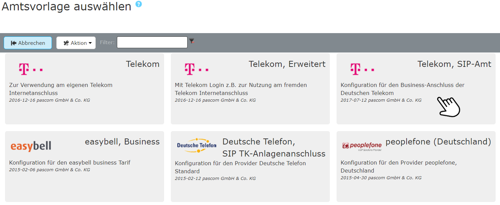





## Telekom Training Video
 


## Übersicht

Tarif in Kombination mit pascom: **DeutschlandLan SIP Trunk**  

Informationen über Leistungsmerkmale und Tarife finden Sie [hier](https://geschaeftskunden.telekom.de/startseite/festnetz-internet/tarife/333506/deutschlandlan-sip-trunk.html). Die [pascom Telefonanlage](https://www.pascom.net/de/voip-telefonanlage/ "pascom VoIP-Telefonagen Software") (sowohl Onsite als auch Cloud) unterstützt nur Business-SIP-Trunk Anschlüsse der Telekom.



Nach dem Erwerb und der Freischaltung Ihres Telekom SIP-Trunks erhalten Sie einen Brief mit Ihren Account-Daten, die wie folgt aussehen können:

**Telekom SIP-Trunk**

Hat **eine** Registrierungsrufnummer und einen Rufnummernblock.

+ *Ortsvorwahl*: 0991
+ *Stammnummer*: XXXXXX (aus Datenschutzgründen hier mit XXXXXX dargestellt)
+ *Rufnummernblock*: 0-99, daraus ergeben sich 2-stellige Durchwahlen (Nebenstellen)
+ *Registrierungs-Daten für Ihr Amt*, bestehend aus Telefonie-Benutzername und Telefonie-Passwort
+ *Registrierungsrufnummer*: in diesem Beispiel +49991XXXXXX0



### Amtsvorlage verwenden

Fügen Sie ein neues Telekom-Amt ein unter  >  > . Sie gelangen nun zur Ämter-Datenbank. Über den Filter können Sie direkt nach *Telekom* suchen. Wählen Sie die Vorlage *Telekom SIP-Amt* und befüllen Sie die Vorlage mit den erhaltenen Account-Daten.

 

 

**Befüllen Sie die Amtsvorlage**  

|Variable|Beschreibung|
|---|---|
|**Bezeichnung**|Geben Sie Ihrem Amt einen Namen, dieser erscheint in der Ämterliste.|
|**Telefonie-Benutzername**|Entnehmen Sie den Telefonie-Benutzernamen aus Ihren Zugangsdaten.|
|**Telefonie-Passwort**|Tragen Sie hier das dazu gehörige Telefonie-Passwort ein.|
|**Registrierungsrufnummer**|Entnehmen Sie die Registrierungsrufnummer aus Ihren Zugangsdaten.|
|**Ortskennzahl**|Tragen Sie die Ortskennzahl bzw. Ortsvorwahl ohne führende 0 ein. In unserem Beispiel *991*.|
|**Stammnummer**|Basisnummer des Telefonanschlusses ohne Nebenstellen. In unserem Beispiel als *XXXXXX* dargestellt.|
|**Präfix eing. Nummer**|Ist eine beliebige Ziffer, die bei eingehenden Telefonanrufen über dieses Amt vorangestellt wird. Wenn Sie hier eine 0 eingeben erscheint beispielsweise in der Anruferliste von IP-Telefonen dann nicht die 0172123123 sondern die 00172123123. Dadurch können Sie direkt aus der Anruferliste wieder über das selbe Amt zurückrufen.|
|**Anzahl der Durchwahlstellen**|Anzahl der Stellen der Benutzer-Durchwahlen. (NICHT die Anzahl der Nummern im Rufnummernblock!)|
|**Durchwahl Zentrale**|Geben Sie hier an, auf welche interne Durchwahl die erste Nummer Ihres Rufnummernblocks (meistens die 0) abgeworfen werden soll.|

 

### Beispiel

Nach dem  wird das Amt angelegt. 

### Einen weiteren Telekom-SIP-Account hinzufügen

Möchten Sie Ihren Telekom SIP-Trunk-Anschluss um einen weiteren Account erweitern, fügen Sie diesen unter dem aktuellen Amt im Tab  ein. Da die grundsätzlichen Einstellungen die gleichen sind, können Sie den schon angelegten Account verwenden. Markieren Sie diesen mit einem Klick und klicken Sie anschließend auf den Button .
In der neuen Account-Zeile können Sie nun **Benutzername** (entspricht der *Registrierungsrufnummer*), das **Passwort** und den **Anmeldenamen** (entspricht dem *Telefonie-Benutzernamen*) und bei Bedarf weitere Felder anpassen.

Nun müssen [eingehende und ausgehende Rufregeln]() angepasst werden. Bei den ausgehenden Regeln müssen Sie nun auswählen welcher Account pro Regel verwendet werden soll. Scrollen Sie hierfür nach rechts und wählen in der Spalte  den entsprechenden aus.



Um sicher zu gehen ob Ihre Daten korrekt eingegeben wurden und ob sich die pascom Telefonanlage erfolgreich beim Provider registriert hat, klicken Sie unter  -  auf das  bei Ihrem Amt.
Hier sehen Sie ob die **Registrierung** geklappt hat. (*registered*).



Für die Onsite Telefonie wird für diesen Provider der pascom Outbound Proxy benötigt. In den  finden Sie die Einstellung , für welche der **Outbound Proxy** aktiviert werden soll.



Das Amt ist eingerichtet und erfolgreich registriert. Als letzten Schritt definieren Sie Ihre eingehenden und ausgehenden Rufregeln um das Anrufverhalten Ihrer pascom Telefonanlage einzustellen. 

Das Einrichten von Rufregeln erklären wir Ihnen in der Anleitung zu den [Rufregeln]()