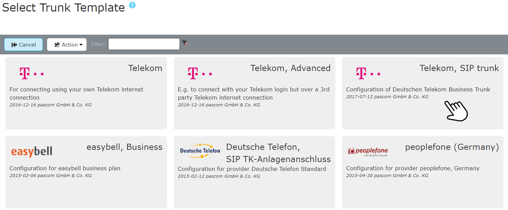





## Overview

Tariff in combination with pascom: **DeutschlandLAN SIP Trunk**  

{}
**Telekom Company Flex SIP Trunk** is not supported yet.
{}

Deutsche Telekom package specifications and tariff information can be found [here](https://geschaeftskunden.telekom.de/startseite/festnetz-internet/tarife/333506/deutschlandlan-sip-trunk.html). pascom phone systems (onsite and cloud) support only Deutsche Telekom business SIP Trunk tariffs.  



Once your Deutsche Telekom  SIP-Trunk has been activated, you will receive a letter (in German) containing your account data similar to below. 

**Telekom SIP-Trunk**

Has **one** registration number and a number block.

+ *Ortsvorwahl (Area Code)*: 0991
+ *Stammnummer (Line Number) *: XXXXXX (XXXXXX is displayed due to data protection purposes)
+ *Rufnummernblock (Number Block)*: 0-99, resulting in a 2-digit extension format (externally reachable)
+ *Registrierungs-Daten für Ihr Amt (Trunk registration data)*, Constructed from the telephony username and telephony password.
+ *Registrierungsrufnummer (Registration phone number)*: in this example +49991XXXXXX0



### Completing the Trunk Template

Add a new Deutsche Telekom SIP trunk under  >  > , which directs you the the SIP provider database. Using the filter, you can search directly for *Deutsche Telekom* templates. Select the *Deutsche Telekom SIP Trunk* template and add your account data / credentials to the template setup wizard.

 

 

**Fill in the Variables**

|Variable|Description|
|---|---|
|**Name**|Enter a name for the trunk, which will be displayed in the Trunks overview.|
|**Telephony username**|Use the telephony username from your registration data.|
|**Telephony password**|Enter the corresponding password.|
|**Number of registration**|Registration phone number (Registrierungsrufnummer) as found in the registration data.|
|**Area code**|Enter your area code (Ortskennzahl / Ortsvorwahl) excluding the leading 0, e.g. *991*.|
|**Originating number**|Telephony connection base / line number (Stammnummer) excluding extension number block e.g. the number displayed as *XXXXXX* in our example.|
|**Prefix for incoming number**|Any digit which should precede all incoming calls via this trunk. For example entering 0 will mean that all inbound call numbers will be displayed in the call logs on IP Phones as 00172123123 instead of 0172123123. This enables the direct call back from the call history via this trunk.|
|**Number of extension digits**|The digit length of User Extensions - NOT the number of digits in the number block|
|**Extension for central**|Enter the internal extension number to which calls to the first number of your number block (normally 0) should be routed, i.e. to the switchboard / reception / AutoAttendant.|

### Example

After pressing  the trunk will be added. 

### Adding Additional Deutsche Telekom SIP Accounts

Should you wish to extend your Deutsche Telekom DeutschlandLAN SIP-Trunk connection by adding an additional account, add the new account in the existing Trunk configuration under the  tab. Since the default settings (basic settings) are the same for both accounts, all you need to do is highlight the account and press the  button. In the new account row that will appear, you can now adapt the settings by adding the new **Username** (i.e. *Registrierungsrufnummer*), the **password** and the **Auth_User** (i.e. the *telefonie-Benutzernamen*) as well as updating the other fields to match your needs.

Next, the [inbound and outbound call rules]() must be modified. By the outbound rules you will need choose which account should be used per rule. Scroll to the right and under the  column choose the desired account.



To make sure that your data has been entered correctly and that the pascom PBX has successfully registered with your provider, click on the  -  on the  at your trunk.
Here you can see if the **registration** has worked. (*registered*).



For onsite telephony, the pascom Outbound Proxy is required for this provider. In the  you will find the setting  for which the **Outbound Proxy** should be activated.



The trunnk is established and successfully registered. As a final step, you define your incoming and outgoing call rules to set the call behavior of your pascom telephone system. 

We explain how to set up call rules in the [Call Rules Tutorial]({)
