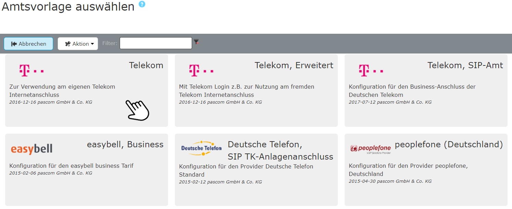
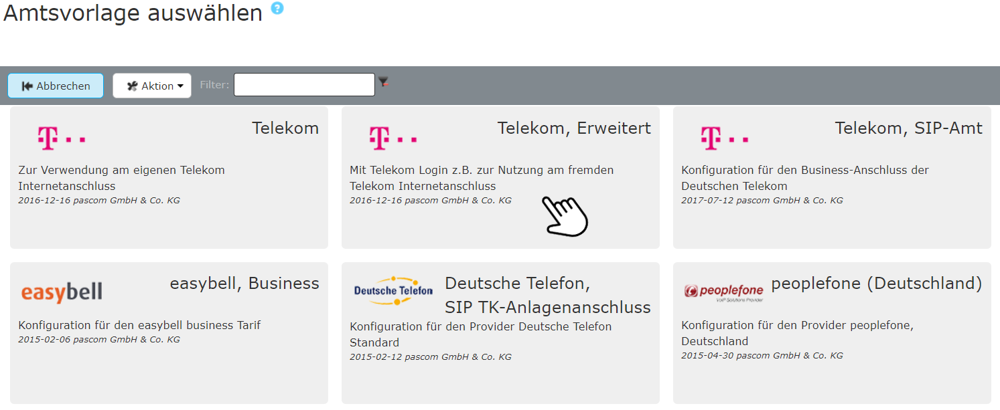





## Übersicht

Tarif in Kombination mit pascom: **Einzelrufnummer tel.telekom**  

{}
pascom unterstützt die direkte Registrierung des SIP Accounts in der pascom Telefonanlage nur in Verbindung mit dem von der Telekom [empfohlenen Lancom Router](https://geschaeftskunden.telekom.de/startseite/festnetz-internet/tarife/354892/paket-zum-anschluss-einer-ip-telefonanlage.html) für den Anschluss einer IP-Telefonanlage. Alternativ kann die [Registrierung in einer Fritzbox]() vorgenommen werden.  
Wenn Sie einen eigenen Router betreiben muss dieser grundsätzlich die gleichen Kriterien erfüllen wie das empfohlene Gerät der Telekom. In diesem Fall übernehmen wir allerdings keinen Support seitens pascom.
{}



### Mehrgeräte und erweiterter Mehrgeräte Anschluss

Der Unterschied ist simpel. Bei einem normalen Mehrgeräte Anschluss registrieren Sie sich an Ihrem Standort mit einer festen Telefonnummer (Standortgebunden). Bei einem erweiterten Mehrgeräte Anschluss erhalten Sie zusätzlich eine Login-Email und Login-Password um den Tarif in der Cloud zu benutzen (Nomadisch).

#### Mehrgeräte Anschluss

Hat mehrere feste Rufnummern.

**Welche Daten können Sie daraus entnehmen?**

+ *Rufnummern*: Sie benötigen nur die Rufnummern zur Einrichtung des Amt

Bei den Zugangsdaten handelt es sich um die Internet-Zugangsdaten.
Diese werden nicht für die Einrichtung des Telekom Amts benötigt.

#### Erweiterter Mehrgeräte Anschluss

Hat mehrere feste Rufnummern und einen Email-/Password Registrar

**Welche Daten können Sie daraus entnehmen?**

+ *Login Email*: Benutzername für die Registrierung
+ *Login Password*: Password für die Registrierung
+ *Rufnummern*: Rufnummern zur Einrichtung des Amt



<!-- TAB ONSITE ---------------------------------------------------------------- -->
{}
{}

### Router vorbereiten

Bevor Sie mit der Einrichtung des Telekom Amt auf der pascom Telefonanlage beginnen, stellen Sie sicher, dass folgende Einstellungen auf Ihrem Router getätigt wurden.

1. SIP-ALG deaktivieren.
2. Die Registrierung des Telekom Amt muss auf dem Router deaktiviert sein.

**Beispiel**

Die folgenden Screenshots wurden erstellt mit einem *LANCOM R883VAW (über ISDN)* mit der Firmware 10.00.0170.

Die SIP-ALG-Einstellungen finden Sie auf der Web-Oberfläche des LANCOM-Routers unter  >  > .
Deaktivieren Sie das Kontrollkästchen "SIP-ALG aktiviert".

Die Trunk-Konfiguration finden Sie in der Web-Benutzeroberfläche des LANCOM-Routers unter  >  >  > .
Stellen Sie sicher, dass diese Einstellungen entweder leer oder deaktiviert sind.  

### Amtsvorlage befüllen

Fügen Sie ein neues Telekom-Amt ein unter  >  > . Sie gelangen nun zur Ämter-Datenbank. Über den Filter können Sie direkt nach *Telekom* suchen. Wählen Sie die Vorlage **Telekom** und befüllen Sie die Vorlage mit den erhaltenen Account-Daten.

 

 

**Variablen befüllen**

|Variable|Beschreibung|
|---|---|
|**Bezeichnung**|Geben Sie Ihrem Amt einen Namen, dieser taucht dann in der Ämterliste auf.|
|**Erste Rufnummer**|Geben Sie die erste Rufnummer ein.|
|**Erste Rufnummer Nebenstelle**|Tragen Sie hier die interne Durchwahl für die Rufnummer ein.|
|**Zweite Rufnummer**|Geben Sie die zweite Rufnummer ein.|
|**Zweite Rufnummer Nebenstelle**|Tragen Sie hier die interne Durchwahl für die Rufnummer ein.|
|**Dritte Rufnummer**|Geben Sie die dritte Rufnummer ein.|
|**Dritte Rufnummer Nebenstelle**|Tragen Sie hier die interne Durchwahl für die Rufnummer ein.|
|**Ortskennzahl**|Tragen Sie die Ortskennzahl bzw. Ortsvorwahl ohne führende 0 ein. In unserem Beispiel *991*.|
|**Präfix eing. Nummer**|Ist eine beliebige Ziffer, die bei eingehenden Telefonanrufen über dieses Amt vorangestellt wird. Wenn Sie hier eine 0 eingeben erscheint beispielsweise in der Anruferliste von IP-Telefonen dann nicht die 0172123123 sondern die 00172123123. Dadurch können Sie direkt aus der Anruferliste wieder über das selbe Amt zurückrufen.|

### Beispiel

Nach dem  wird das Amt angelegt.



Um sicher zu gehen ob Ihre Daten korrekt eingegeben wurden und ob sich die pascom Telefonanlage erfolgreich beim Provider registriert hat, klicken Sie unter  -  auf das  bei Ihrem Amt.
Hier sehen Sie ob die **Registrierung** geklappt hat. (*registered*).



Für die Onsite Telefonie wird für diesen Provider der pascom Outbound Proxy benötigt. In den  finden Sie die Einstellung , für welche der **Outbound Proxy** aktiviert werden soll.



Das Amt ist eingerichtet und erfolgreich registriert. Als letzten Schritt definieren Sie Ihre eingehenden und ausgehenden Rufregeln um das Anrufverhalten Ihrer pascom Telefonanlage einzustellen. 

Das Einrichten von Rufregeln erklären wir Ihnen in der Anleitung zu den [Rufregeln]()



{}
Bei der Verwendung der Fritz!Box ist der Anschluss auf die Benutzung von zwei Sprach-Kanälen aufgrund der Fritz!Box-Firmware beschränkt.
{}

Folgende Anleitung wurde unter Verwendung der *Fritz!Box Fon WLAN 7390* mit der Firmware 06.83 erstellt.

#### Vorbereitung der Fritz!Box

Zuerst müssen Sie auf der Fritz!Box die Telekom-Rufnummern einrichten, sodass sich die Fritz!Box sich korrekt mit der Telekom verbinden kann.

1. Surfen Sie auf die WebUI Ihrer Fritz!Box
2. Unter  >  klicken Sie auf .
3. Wählen Sie bei  *Telekom* aus.
4. Tragen Sie die *Ortsvorwahl* und die *Rufnummer* aus Ihrem Brief mit den Accountdaten ein.
5. Wählen Sie  und wiederholen Sie Schritt 4 mit allen Rufnummern aus Ihrem Brief mit den Accountdaten.
6. Bestätigen Sie die Einstellungen in der aktuellen und allen folgenden Masken mit  und .

Die Fritz!Box wird sofort versuchen mit den angegebenen Daten eine Verbindung zur Telekom aufzubauen.

Nachdem die Telekom-Rufnummern erfolgreich eingerichtet wurden, müssen Sie auf der Fritz!Box Accounts anlegen, mit denen sich die pascom bei der Fritz!Box registrieren kann.

1. Auf der WebUI Ihrer Fritz!Box unter  >  klicken Sie auf .
2. Wählen Sie *Telefon (mit oder ohne Anrufbeantworter)* aus.
3. Wählen Sie im nächsten Schritt *LAN/WLAN (IP-Telefon)* und vergeben Sie einen Namen.
4. Anschließend geben Sie einen *Benutzernamen* und ein *Kennwort* ein. Diese müssen Sie sich merken, da Sie in der pascom benötigt werden.
5. Wählen Sie die Rufnummern Ihres Telefonanschlusses, über die eingehende Gespräche des Accounts geführt werden sollen.
6. Nun muss die Nummer für ausgehende Rufe gewählt werden. Wählen Sie hier die Nummer, die Sie davor für eingehende Rufe ausgewählt haben.
7. Im letzten Schritt übernehmen Sie die Einstellungen. Falls dies der erste Account ist, den Sie in dieser Session einrichten, müssen Sie bestätigen, dass Sie befugt sind diese Änderungen vorzunehmen. Gehen Sie zu Ihrer Fritz!Box und drücken Sie eine beliebige Taste.
8. Wollen Sie alle Rufnummern Ihres Telekom-Anschlusses nutzen, wiederholen Sie die Schritte 1 - 7 um für alle Rufnummern einen Account anzulegen.
9. In der Übersicht Ihrer Telefonie-Geräte sehen Sie die interne Nummer des Accounts (z. B. \**620). Diese Durchwahl müssen Sie sich ebenfalls für die Einrichtung in der pascom merken.

#### Fritz!Box-Amt in der pascom einrichten

**Amt-Vorlage befüllen**

Fügen Sie ein neues Fritz!Box-Amt ein unter  >  > . Sie gelangen nun zur Ämter-Datenbank. Über den Filter können Sie direkt nach *fritz* suchen und die Vorlage anschließend auswählen. Befüllen Sie die Vorlage mit den auf der Fritz!Box eingestellten Account-Daten.

Über die Vorlage können die ersten 3 Accounts angelegt werden.

|Variable|Beschreibung|
|---|---|
|**Bezeichung**|Geben Sie Ihrem Amt einen Namen, dieser taucht dann in der Ämterliste auf.|
|**Host**|Geben Sie hier die IP-Adresse bzw. die Domain Ihrer Fritz!Box ein.|
|**Benutzername Leitung X**|Der Benutzername des Accounts, den Sie auf der Fritz!Box angelegt haben.|
|**Passwort Leitung X**|Das zur Leitung gehörige Passwort.|
|**Durchwahl für Leitung X**|Die  zur Leitung gehörige Durchwahl, die die Fritz!Box Ihrer Leitung beim Anlegen vergeben hat.|
|**Internationale Vorwahl**|Geben Sie hier die internationale Vorwahl an. z. B. 00|
|**Nationale Vorwahl**|Geben Sie hier die nationale Vorwahl an. z. B. 0|
|**Länderkennung**|Tragen Sie die Länderkennung Ihres Anschlusses ein. z. B. 49 für Deutschland.|
|**Ortskennzahl**|Tragen Sie die Ortskennzahl bzw. Ortsvorwahl ohne führende 0 ein.  z. B. 89 für München|
|**Präfix. eing. Nummer**|Ist eine beliebige Ziffer, die bei eingehenden Telefonanrufen über dieses Amt vorangestellt wird. Wenn Sie hier eine 0 eingeben erscheint beispielsweise in der Anruferliste von IP-Telefonen dann nicht die 0172123123 sondern die 00172123123. Dadurch können Sie direkt aus der Anruferliste wieder über das selbe Amt zurückrufen.|

Nach dem  wird das Amt angelegt. Wenn Sie weitere Accounts in der Fritz!Box angelegt haben können Sie diese jetzt im Reiter  ergänzen. Wählen Sie dazu einen Eintrag aus und klicken Sie auf . Bei den duplizierten Einträgen reicht es aus *Benutzernamen*, *Passwort* und *Durchwahl reg.* entsprechend anzupassen.

**Rufregeln anpassen**

Die Rufregeln der ersten 3 Accounts werden automatisch angelegt, die Rufregeln aller weiteren Accounts müssen manuell angelegt werden. Diese können Sie gemäß Ihren Anforderungen und Wünschen konfigurieren und erweitern. Lesen Sie dazu den Artikel über [Rufregeln]().

Die Vorlage geht davon aus, dass die Durchwahlen auf der Fritz!Box mit den Durchwahlen auf der pascom übereinstimmen. Sollte das nicht der Fall sein, müssen Sie dies unter  >  > Amt auswählen >  in den Tabs  und  anpassen.

|Eingehende Rufe||
|---|---|
|Ziel|Das ist die Durchwahl auf der Fritz!Box (z. B. 620, 621...)|
|Durchwahl|Das ist die Durchwahl, auf die bei einem eingehenden Anruf abgeworfen wird. Das kann ein Benutzer, ein Team, etc. sein.|

|Ausgehende Rufe||
|---|---|
|Quelle|Das ist die Durchwahl des Benutzers der einen Anruf starten möchte|
|CIDNummer|Das ist die Durchwahl auf der Fritz!Box (z. B. 620, 621...)|
|Account|Hier muss der Account ausgewählt werden, dem die CIDNummer auf der Fritz!Box zugeordnet ist.|

{}
<!-- TAB CLOUD ---------------------------------------------------------------- -->
{}
### Amtsvorlage befüllen

Fügen Sie ein neues Telekom-Amt ein unter  >  > . Sie gelangen nun zur Ämter-Datenbank. Über den Filter können Sie direkt nach *Telekom* suchen. Wählen Sie die Vorlage **Telekom, Erweitert** und befüllen Sie die Vorlage mit den erhaltenen Account-Daten.

 

 

**Variablen befüllen**

|Variable|Beschreibung|
|---|---|
|**Bezeichnung**|Geben Sie Ihrem Amt einen Namen, dieser taucht dann in der Ämterliste auf.|
|**Telekom Login Email**|Geben Sie Ihre T-Online Email Adresse ein.|
|**Telekom Login Password**|Geben Sie das dazugehörige Email Password ein.|
|**Erste Rufnummer Nebenstelle**|Tragen Sie hier die interne Durchwahl für die Rufnummer ein.|
|**Zweite Rufnummer**|Geben Sie die zweite Rufnummer ein.|
|**Zweite Rufnummer Nebenstelle**|Tragen Sie hier die interne Durchwahl für die Rufnummer ein.|
|**Dritte Rufnummer**|Geben Sie die dritte Rufnummer ein.|
|**Dritte Rufnummer Nebenstelle**|Tragen Sie hier die interne Durchwahl für die Rufnummer ein.|
|**Ortskennzahl**|Tragen Sie die Ortskennzahl bzw. Ortsvorwahl ohne führende 0 ein. In unserem Beispiel *991*.|
|**Präfix eing. Nummer**|Ist eine beliebige Ziffer, die bei eingehenden Telefonanrufen über dieses Amt vorangestellt wird. Wenn Sie hier eine 0 eingeben erscheint beispielsweise in der Anruferliste von IP-Telefonen dann nicht die 0172123123 sondern die 00172123123. Dadurch können Sie direkt aus der Anruferliste wieder über das selbe Amt zurückrufen.|

### Beispiel

Nach dem  wird das Amt angelegt. Dabei werden automatisch Rufregeln angelegt. Diese können Sie gemäß Ihren Anforderungen und Wünschen konfigurieren. Lesen Sie dazu den Artikel über [Rufregeln]().



Um sicher zu gehen ob Ihre Daten korrekt eingegeben wurden und ob sich die pascom Telefonanlage erfolgreich beim Provider registriert hat, klicken Sie unter  -  auf das  bei Ihrem Amt.
Hier sehen Sie ob die **Registrierung** geklappt hat. (*registered*).



Das Amt ist eingerichtet und erfolgreich registriert. Als letzten Schritt definieren Sie Ihre eingehenden und ausgehenden Rufregeln um das Anrufverhalten Ihrer pascom Telefonanlage einzustellen. 

Das Einrichten von Rufregeln erklären wir Ihnen in der Anleitung zu den [Rufregeln]()
{}
{}

