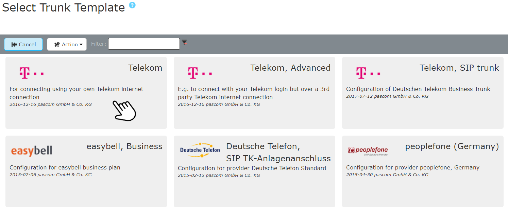
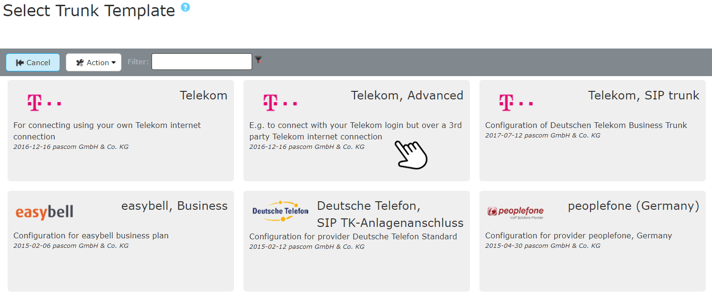





## Overview

Tariff in combination with pascom: **Single Number tel.telekom**  

{}
pascom phone systems only supports direct SIP account registration in combination with the Deutsche Telekom [recommended Lancom Router](https://geschaeftskunden.telekom.de/startseite/festnetz-internet/tarife/354892/paket-zum-anschluss-einer-ip-telefonanlage.html) when connecting an IP PBX. Alternatively, it is possible to perform the [registration on a FritzBox]() .  
Should you use your own router, this must in principle comply with the criteria as the devices recommended by Deutsche Telekom.  However, in such as scenario, pascom are not able to offer any support for the configuration.
{}



Once your Deutsche Telekom Trunk has been activated, you will receive a letter (in German) containing your account data similar to below. 

### Multipoint Connection and advanced Multipoint Connection

The difference is simple. With a normal multipoint  connection, you register at your location with a fixed telephone number (location-based). With an advanced multipoint connection you will also receive a login email and login password to use the tariff in the cloud (nomadic).

#### Multipoint Connection

Has multiple fixed line numbers (Landline Nos.).

**Important Information**

*Rufnummern (Phone Number)*: Is needed when setting up the trunk

The Zugangsdaten (Login info) refer to the internet access credentials.
This is not needed when setting up a Deutsche Telekom trunk.

#### Advanced Multipoint Connection

Has multiple fixed line numbers and a Email-/Password Registrar

**Important Information**

+ *Login Email*: UserName for registering the Trunk
+ *Login Password*: Password for registering the Trunk
+ *Rufnummern*: Line Numbers to set up the Trunk



{}
{}

### Router preparation

Before beginning with the Deutsche Telekom trunk setup within your pascom phone system, please make sure that the following settings have been configured on your router:

1. SIP-ALG must be deactivated.
2. The Deutsche Telekom trunk must no be setup on the router or must be deactivated.

Having checked the above, you can continue with adding the Trunk via the pascom phone system admin Web UI.

### Example

The following screenshots were created using a *LANCOM R883VAW (over ISDN)* with the Firmware 10.00.0170.

The SIP-ALG settings are found on the LANCOM router Web UI under  >  > .
Uncheck the "SIP-ALG activated" box.

The trunk configuration is found within the LANCOM router web UI under  >  >  > .
Makes sure that these settings are either empty or deactivated.

#### Completing the Trunk Template

Add a new Deutsche Telekom trunk under  >  > , which directs you the the SIP provider database. Using the filter, you can search directly for *Deutsche Telekom* templates. Select the **Telekom** template and add your account data / credentials to the template setup wizard.

 

 

**Fill in the Variables**

|Variable|Beschreibung|
|---|---|
|**Name**|Enter a name for the trunk, which will be displayed in the Trunks overview.|
|**First Number**|Enter the first number.|
|**First Number extension**|Enter the internal extension for the number.|
|**Second Number**|Enter the second number.|
|**Second Number extension**|Enter the internal extension for the number.|
|**Third Number**|Enter the third number.|
|**Third Number extension**|Enter the internal extension for the number.|
|**Area code**|Enter your area code (Ortskennzahl / Ortsvorwahl) excluding the leading 0, e.g. *991*.|
|**Prefix for incoming number**|Any digit which should precede all incoming calls via this trunk. For example entering 0 will mean that all inbound call numbers will be displayed in the call logs on IP Phones as 00172123123 instead of 0172123123. This enables the direct call back from the call history via this trunk.|

### Example

After pressing  the trunk will be added. 



To make sure that your data has been entered correctly and that the pascom PBX has successfully registered with your provider, click on the  -  on the  at your trunk.
Here you can see if the **registration** has worked. (*registered*).



For onsite telephony, the pascom Outbound Proxy is required for this provider. In the  you will find the setting  for which the **Outbound Proxy** should be activated.



The trunnk is established and successfully registered. As a final step, you define your incoming and outgoing call rules to set the call behavior of your pascom telephone system. 

We explain how to set up call rules in the [Call Rules Tutorial]({)



{}
When using a Fritz!Box, the connection is limited to two voice channels due to the Fritz!Box firmware.
{}

The following guide has been created using a *Fritz!Box Fon WLAN 7390* with Firmware version 06.83.

#### Preparing the Fritz!Box

Firstly, you will need to setup the telekom phone numbers on the Fritz!Box in order to ensure that the Fritz!Box can correctly connect to Deutsche Deutsche Telekom.

1. Log in to your Fritz!Box Web UI.
2. Under  >  clcik on .
3. Select *Deutsche Telekom* as your .
4. Enter your *Area Code* and *Line Number* as stated in your account activation letter (see above).
5. Enter  and repeat the process from step 4 with all numbers from your account info letter.
6. Confirm the settings in the current and all following screens by clicking  and .

The Fritz!Box will immediately try to establish a connection with Deutsche Deutsche Telekom using the entered credentials.

After the Deutsche Telekom numbers have been successfully setup, you will need to setup some accounts on your Fritz!Box with which your pascom PBX can register with the Fritz!Box.

1. In the Fritz!Box web UI  under  >  click on .
2. Select *Telephone (with or without Voicemail)*.
3. In the next step, select *LAN/WLAN (IP Telephone)* and enter a name for the device.
4. Finally enter a *Username* and *Password*. Make a note of these as they are required by the pascom PBX.
5. Select the phone number(s) over which incoming calls to your account should be routed.
6. Now select the number of outbound calls. Select the number which you selected for incoming calls in the previous step.
7. Apply the settings. If this the first account you have added in this session, you will be required to confirm that you are permitted to complete the process. Simply go to you Fritz!Box and press any key.
8. If you would like to use all the numbers of your Deutsche Telekom account, then repeat steps 1 -7 for each number. 
9. Within the Telephony Device Overview you should now see the internal numbers pertaining to the account (e.g. \**620). You will need this extension for the registration with your pascom PBX.

#### pascom Fritz!Box Trunk Setup

**Complete the Trunk Template**

Add a new Frtz!Box trunk under  >  > , which directs you the the SIP provider database. Using the filter, you can search directly for *fritz* templates and select this template. Complete the template using the account data you have just set up on your Fritz!Box.

Using the template, it is possible to add the first 3 accounts.

|Variable|Description|
|---|---|
|**Name**|Enter a name for the trunk, which will be displayed in the Trunks overview.|
|**Host**|Enter the IP address / Domain name for your Fritz!Box.|
|**Username line X**|The account username which you configured on your Fritz!Box.|
|**Password line X**|The corresponding password.|
|**Extension for line X**|The extension belonging to the line / phone number which your Fritz!Box assigned to this line (phone number).|
|**International codel**|Enter the international code (e.g. 00)|
|**National dialling code**|Enter the national code (e.g. 0).|
|**Country code**|Enter the country code for your account. e.g. 49 for Germany, 44 for the UK.|
|**Area code**|Enter your area code excluding the leading 0 e. g. 89 for Munich or 203 for London|
|**Prefix for incoming number**|Any digit that precedes incoming phone calls via this trunk. If you enter 0 here for example, then the incoming call number will be display as 00172123123 on your IP phone's display instead of 0172123123. This allows you to call back the number using the same trunk / account phone number.|

After  the trunk will be added. If you have added further accounts to your Fritz!Box, you can add these under the  tab. Simply select an entry and click on . When duplicating an entry, it is sufficient to only update the *Username*, *Password* and *Extension reg.* columns.

**Modify Call Rules**

The call rules for the first 3 accounts will be automatically added. All further account call rules must be added manually. These can be configured according to your requirements. Further to this please read the article [Call Rules]().

The templates assumes that the extensions on the Fritz!Box match the extensions added on your pascom PBX. Should this not be the case, your will need to modify the call rules under  >  > select trunk >  and under the  and  tabs.

|Inbound Calls||
|---|---|
|Destination|The extension as shown on the Fritz!Box (e. g. 620, 621...)|
|Extension|The extension on which incoming calls should be routed. This can be a user, team etc.|

|Outbound Calls||
|---|---|
|Source|The user extension which is initiating the call|
|CIDNumber|This is the extension as assigned by the Fritz!Box (e. g. 620, 621...).|
|Account|An account must be selected with which the CIDNumber on the Fritz!Box is assigned to.|

{}
<!-- TAB CLOUD ---------------------------------------------------------------- -->
{}
### Completing the Trunk Template

Add a new Deutsche Telekom SIP trunk under  >  > , which directs you the the SIP provider database. Using the filter, you can search directly for *Deutsche Telekom* templates. Select the **Telekom, Advanced** template and add your account data / credentials to the template setup wizard.

 

 

**Fill in the Variables**

|Variable|Beschreibung|
|---|---|
|**Name**|Enter a name for the trunk, which will be displayed in the Trunks overview.|
|**Telekom Login Email**|Enter your T-Online Email Address.|
|**Telekom Login Password**|Enter your T-Online Password.|
|**First Number**|Enter the first number.|
|**First Number extension**|Enter the internal extension for the number.|
|**Second Number**|Enter the second number.|
|**Second Number extension**|Enter the internal extension for the number.|
|**Third Number**|Enter the third number.|
|**Third Number extension**|Enter the internal extension for the number.|
|**Area code**|Enter your area code (Ortskennzahl / Ortsvorwahl) excluding the leading 0, e.g. *991*.|
|**Prefix for incoming number**|Any digit which should precede all incoming calls via this trunk. For example entering 0 will mean that all inbound call numbers will be displayed in the call logs on IP Phones as 00172123123 instead of 0172123123. This enables the direct call back from the call history via this trunk.|

### Example

After pressing  the trunk will be added. Doing so will automatically add default call rules, which can then be adapted according to your requirements. For more please read the following article on [Call Rules]().



To make sure that your data has been entered correctly and that the pascom PBX has successfully registered with your provider, click on the  -  on the  at your trunk.
Here you can see if the **registration** has worked. (*registered*).



The trunnk is established and successfully registered. As a final step, you define your incoming and outgoing call rules to set the call behavior of your pascom telephone system. 

We explain how to set up call rules in the [Call Rules Tutorial]({)
{}
{}

