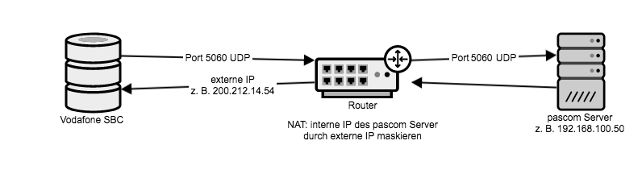
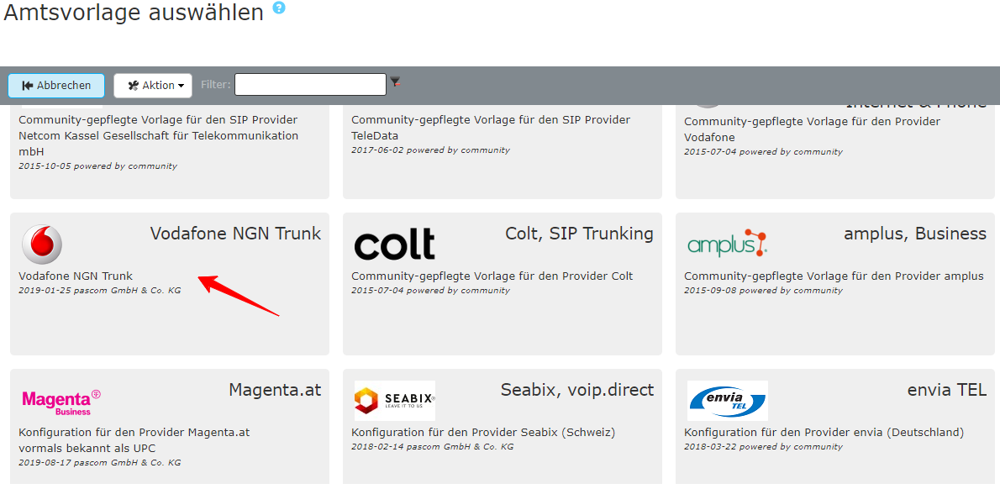
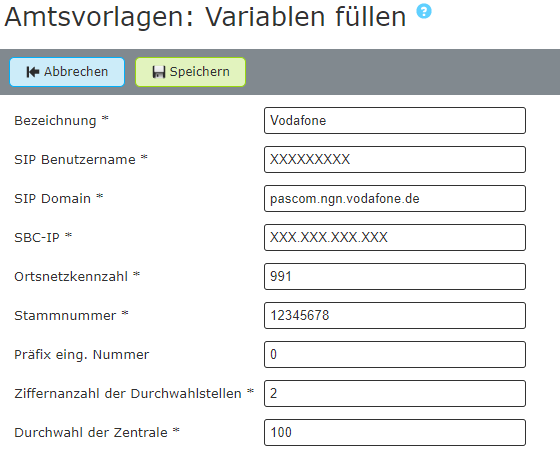





## Übersicht

Tarif in Kombination mit pascom: **Vodafone NGN Trunk**  

Ab pascom 18.05 ist die Amtsvorlage für Vodafone NGN Trunks ([IP Anlagenanschluss](https://www.vodafone.de/business/festnetz-internet/ip-anlagen-anschluss.html)) verfügbar.

Da die Authentifizierung am SIP Server von Vodafone über die IP Adresse Ihres Internetanschlusses stattfindet, ist eine Konfiguration dieses Trunks nur in selbstgehosteten pascom OnSite Telefonanlagen möglich.



Nach dem Erwerb und der Freischaltung Ihres Vodafone NGN Trunks erhalten Sie einen Brief mit Ihren Account-Daten. Dieses Dokument enthält wichtige Informationen zu Ihrem Telefon-Anschluss:

|Bezeichnung|Beschreibung|Beispiel|
|---|---|---|
|Neue Rufnummer|Rufnummer bzw. Rufnummern-Block des Telefon-Anschlusses|0991/9881499  0..99|
|Durchwahl-Länge|Anzahl an Durchwahlstellen im Falle eines Rufnummern-Blocks|2stellig variabel|
|SIP Username|Benutzername des Telefon-Anschlusses|XXXXXXXXX|
|SBC-IP|IP des SBC, der nur über die Telefonanlagen-IP erreichbar ist|XXX.XXX.XXX.XXX|
|SIP Domain|SIP Domain des Telefon-Anschlusses|pascom.ngn.vodafone.de|
*(Aus Datenschutz-Gründen wurden die exakten Nummern und Daten durch "X" ersetzt)*

{}
Nutzen Sie für eine einfachere Einrichtung des Vodafone NGN Trunk den pascom Outbound Proxy. (ab pascom 19.05)
Die Anleitung zum aktivieren des Outbound Proxy finden Sie [hier]().
{}



Beachten Sie, dass eine SIP-Kommunikation mit dem angegebenen SBC nur von der IP der Telefonanlage aus möglich ist. 
Falls Sie Ihre pascom Telefonanlage in Ihrem eigenen Netzwerk mit einer privaten IP-Adresse verwenden, beachten Sie bitte die notwendigen Netzwerk-Einstellungen an Firewall/ Router (NAT).

Eingehender Verkehr vom SBC der Vodafone muss an die IP-Adresse der pascom Telefonanlage weitergereicht werden. Aus Sicherheitsgründen sollte die Firewall-Regel sich hier ausschließlich auf Port 5060 UDP zu Port 5060 der Telefonanlage beschränken. 
Umgekehrt muss ausgehender Verkehr per NAT modifiziert werden, da der SBC der Vodafone nur Daten von der externen IP von Port 5060 auf Port 5060 UDP des Access akzeptiert.
Abgehend sind Ihre Einstellungen der Telefonanlage mit dem Bereich der RTP Ports zu berücksichtigen, damit diese Pakete von der Telefonanlage über die Firewall zum SBC übertragen werden. 



Fügen Sie ein neues Vodafone NGN-Amt ein unter  >  > . Sie gelangen nun zur Ämter-Datenbank. Über den Filter können Sie direkt nach *Vodafone* suchen und die Vorlage **Vodafone NGN Trunk** anschließend auswählen. Befüllen Sie die Vorlage mit den erhaltenen Account-Daten.

|Variable|Beschreibung|
|---|---|
|**Bezeichnung**|Geben Sie Ihrem Amt einen Namen, dieser taucht dann in der Ämterliste auf.|
|**SIP Benutzername**|Entnehmen Sie den Benutzernamen aus Ihren Zugangsdaten *(SIP Username)*.|
|**SIP Domain**|Tragen Sie hier die SIP Domain aus Ihren Zugangsdaten ein.|
|**SBC-IP**|Tragen Sie hier die SBC-IP aus Ihren Zugangsdaten ein.|
|**Ortskennzahl**|Tragen Sie die Ortskennzahl bzw. Ortsvorwahl ohne führende 0 ein. In unserem Beispiel *991*.|
|**Stammnummer**|Basisnummer des Telefonanschlusses ohne Nebenstellen. In unserem Beispiel *9881499*.|
|**Präfix eing. Nummer**|Ist eine beliebige Ziffer, die bei eingehenden Telefonanrufen über dieses Amt vorangestellt wird. Wenn Sie hier eine 0 eingeben erscheint beispielsweise in der Anruferliste von IP-Telefonen dann nicht die 0172123123 sondern die 00172123123. Dadurch können Sie direkt aus der Anruferliste wieder über das selbe Amt zurückrufen.|
|**Anzahl der Durchwahlstellen**|Anzahl der Stellen der Benutzer-Durchwahlen. (NICHT die Anzahl der Nummern im Rufnummernblock!)|
|**Durchwahl Zentrale**|Geben Sie hier an, auf welche interne Durchwahl die erste Nummer Ihres Rufnummernblocks (meistens die 0) abgeworfen werden soll.|

### Beispiel

Nach dem  wird das Amt angelegt. 



Um sicher zu gehen ob Ihre Daten korrekt eingegeben wurden und ob sich die pascom Telefonanlage erfolgreich beim Provider registriert hat, klicken Sie unter  -  auf das  bei Ihrem Amt.
Hier sehen Sie ob die **Registrierung** geklappt hat. (*registered*).



Für die Onsite Telefonie wird für diesen Provider der pascom Outbound Proxy benötigt. In den  finden Sie die Einstellung , für welche der **Outbound Proxy** aktiviert werden soll.



Das Amt ist eingerichtet und erfolgreich registriert. Als letzten Schritt definieren Sie Ihre eingehenden und ausgehenden Rufregeln um das Anrufverhalten Ihrer pascom Telefonanlage einzustellen. 

Das Einrichten von Rufregeln erklären wir Ihnen in der Anleitung zu den [Rufregeln]()

### Einen weiteren Vodafon NGN Account hinzufügen

Möchten Sie Ihren Vodafone NGN Anschluss um einen weiteren Account erweitern, fügen Sie diesen unter dem aktuellen Amt im Tab  ein. Da die grundsätzlichen Einstellungen die gleichen sind, können Sie den schon angelegten Account verwenden. Markieren Sie diesen mit einem Klick und klicken Sie anschließend auf den Button .
In der neuen Account-Zeile können Sie nun **Benutzername** und **Host** und bei Bedarf weitere Felder anpassen.

Nun müssen [eingehende und ausgehende Rufregeln]() angepasst werden. Bei den ausgehenden Regeln müssen Sie nun auswählen welcher Account pro Regel verwendet werden soll. Scrollen Sie hierfür nach rechts und wählen in der Spalte  den entsprechenden aus.

