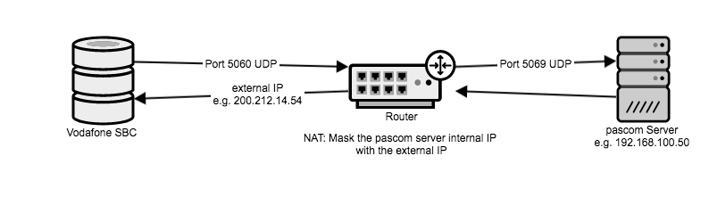





## Overview

Since pascom 18.05, a trunk template for Vodafone NGN Trunks is available.

As the authentication to the Vodafone SIP server takes place via the your Internet connection IP address, configuring these trunks is only possible in a self hosted on-premise pascom phone system. 

## Your Account

After the purchase and activation of your Vodafone NGN trunk, you will receive a letter containing your account information. This document contains important information relating to your telephone connection:

|Name|Description|Example|
|---|---|---|
|New number |Phone number or number block for your telephone connection|0991/9881499  0..99|
|Extension length|Number of extension digits should you have a number block|2 digital variables|
|SIP Username|Telephony connection username|XXXXXXXXX|
|SBC-IP|IP address of the SBC which is only reachable via the telephone system IP |XXX.XXX.XXX.XXX|
|SIP Domain|SIP Domain of the telephony connections|pascom.ngn.vodafone.de|
*(For data proctection purposes exact numbers and data have been replaced with "X")*

{}
{}

## Router Preparation

Please note that SIP communication with the entered SBC is only possible from the phone system IP address. 
Should you use your pascom phone system inside your own network with a private IP address, please verify the necessary network settings on your firewall / router (NAT).

Inbound traffic from the Vodafone SBC must be forwarded onto the pascom phone system. For security reasons, the firewall rule should be exclusively limited to port 5060 UDP to port 5069 of the phone system. 
Conversely, outbound traffic must be modified per NAT, as the Vodafone SBC only accepts data from the external IP from port 5069 to port 5060 UDP of the connection.
Finally, you must consider your phone system settings in terms of the range of RTP ports so that these packets are transmitted from the phone system via the firewall to the SBC. 

## Setup

Under  >  > , add a new Vodafone NGN trunk. This will take you to the Provider Database where you can filter directly for *Vodafone* and the select the template **Vodafone NGN Trunk**. Complete the template using the account data you received.

|Variable|Description|
|---|---|
|**Title**|Enter a name for the trunk, which will then appear in the trunks overview list.|
|**SIP username**|Use the username from your account credentials*(SIP Username)*.|
|**SIP Domain**|Enter the SIP domain from your account info.|
|**SBC-IP**|Enter the SBC IP from your account info.|
|**Area code**|Enter the area code excluding the leading 0. In our example *991*.|
|**Line number**|The base number of the telephony connection excluding extensions. For example *9881499*.|
|**Prefix incoming number**|Any digit that should be attached to inbound calls received via this trunk. If you add 0 here, then it is possible that the call history on an IP phone displays 00172123123 instead of 0172123123. This enables the direct call back from the call history using this trunk.|
|**Extension length**|Number of digits for user extensions (not the amount of numbers in the number block!)|
|**Switchboard extension**|Enter the internal extension number to which calls from the first number of your number block (normally 0).|

After pressing  the trunk will be added. This will also automatically add call rules. These can be modified according to your needs. For further information, please refer to the article [Call Rules]().

### Add an additional Vodafone NGN account

Should you wish to expand your Vodafone NGN connection with an additional account, enter this account to this trunk und the tab . As the base settings are the same, it is possible to use the already added account. Simply select it and click .
In the new account line, you can now modify the **username** and **host** and other fields if necessary.

Now you will need to modify your [inbound and outbound call rules](). For outbound rules, you must now select which Account per rule should be used. To do this, scroll right and under the column  select the appropriate account.
{}

{}

## Setup

Under  >  > , add a new Vodafone NGN trunk. This will take you to the Provider Database where you can filter directly for *Vodafone* and the select the template **Vodafone NGN Trunk**. Complete the template using the account data you received.

{}
For easier setup of the Vodafone NGN trunk, use the pascom outbound proxy without having to configure the NAT. (from pascom 19.05)
Instructions for activating the outbound proxy can be found [here] ().
{}

{}
{}
