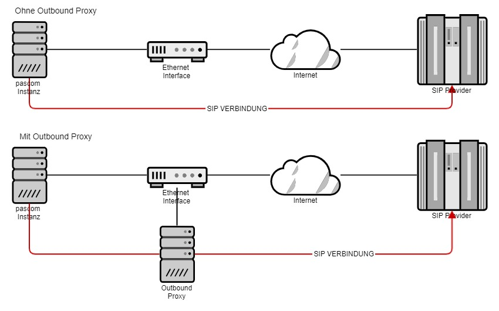
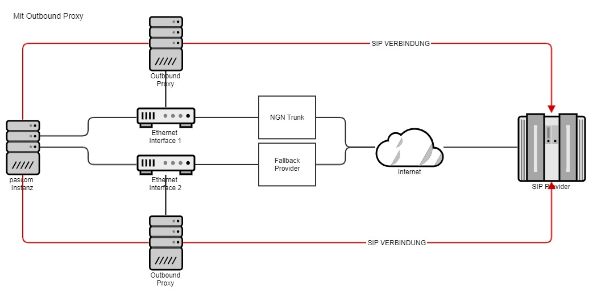





## Konzept

Der Outbound Proxy verwaltet und überwacht Registrierungs- und SIP Pakete zu Ihrem Provider. Zusätzlich optimiert der Outbound Proxy SIP Header mit weiteren Parameter, um ein effizienteres Routing der SIP Datenströme innerhalb der pascom Telefonanlage zu ermöglichen. Dies hat zur Folge, das umständliches NAT Masquerading zur Vergangenheit gehört und dadurch vorallem Nutzer von NGN Trunks provitieren.



Ohne Outbound Proxy spricht die pascom Instanz direkt mit dem SIP Provider und erfordert zusätzlich eine Konfiguration des NAT. Durch Nutzung des Outbound Proxy kümmert sich dieser um die SIP Datenströme und macht so eine Anpassung des NAT überflüssig.

## Nutzung eines NGN Trunks auf separaten Interfaces

Der Outbound Proxy der pascom Telefonanlage sitzt auf den Ethernet Interfaces. Dies erlaubt es, den Outbound Proxy jedem beliebigen Interface zuzuweisen. Somit können Sie die Verbindung zu Ihrem Provider auf einem Interface konfigurieren, während auf dem anderen Interface z.B ein weiterer Provider als Fallback eingerichtet ist.



## Outbound Proxy nutzen

Die Einrichtung des Outbound Proxy ist sehr einfach. In den [Basiseinstellungen]() Ihres Amts unter
 >  >  wählen Sie das entsprechende Interface aus, auf dem der Outbound Proxy aktiv laufen soll.

**Wichtig** Damit die Änderungen wirksam werden, muss der gesamte Host (pascom Anlage) neugestartet werden!


## Outbound Proxy in CSP Installation nutzen

Bei einer CSP Installation kann der Outbound Proxy nicht im jeweiligen Amt einstellt werden, sondern wird per Datei in der Instanz konfiguriert, um Fehlkonfigurationen durch den Instanz-Admin vorzubeugen und den Traffic gezielt managen zu können.

Loggen Sie sich hierzu per SSH auf dem jeweiligen CSP Host ein, betreten Sie via `lxc-attach INSTANZNAME` die gewünschte Instanz und erzeugen Sie die Datei `/etc/pascom/sipproxy.json` mit folgendem Inhalt:

```
{
    "PROVIDER-HOST-DNSNAME" : {
        "proxy" : "HOSTNAME-CONTAINERNAME.cs-proxy.service.pascom",
        "options" : "SIP-OPTIONS"
    }
}
```

Ersetzen Sie die groß geschriebenen Variablen wie folgt:

**PROVIDER-HOST-DNSNAME**

Tragen Sie hier den Hostnamen des Providers ein für den Sie einen Outbound Proxy nutzen möchten. Dadurch wird diese Konfiguration für alle Ämter angewendet die diesen Host als Registrar verwenden.
Z.B. für die Deutsche Telekom `tel.t-online.de`.

**HOSTNAME-CONTAINERNAME**

Ersetzen Sie `HOSTNAME` mit dem Hostnamen des CSP Hosts und `CONTAINERNAME` mit dem Namen des Interface-Containers den Sie als Outbound Proxy nutzen möchten.

Den Hostnamen können Sie per SSH ermitteln:

```
~# hostname
csphost01
~#
```

Den Namen des Interfaces können Sie in der Management UI unter  ablesen:


In unserem Beispiel ist `HOSTNAME-CONTAINERNAME` durch `csphost01-ifens5` zu ersetzen.

**SIP-OPTIONS**

Hier können Sie zusätzliche SIP Optionen für dieses Amt erzwingen, die durch den Instanz-Admin im Amt nicht mehr übersteuert werden können.

Wichtig ist, dass jede SIP Option in einer eigenen Zeile landet. Dies erreichen Sie durch `\n` am Anfang und Ende jeder Option.

Z.B. `\ntransport=tcp\n` um immer SIP TCP zu erzwingen.

### Komplette Beispieldatei für die Telekom

```
{
    "tel.t-online.de" : {
        "proxy" : "csphost01-ifens5.cs-proxy.service.pascom",
        "options" : "\ntransport=tcp\n"
    }
}
```

### (Optional) Konfiguration auf gesamtem CSP Host ausrollen

Anstatt die Datei `/etc/pascom/sipproxy.json` in jeder Instanz zu erzeugen kann man diese auch in die zentrale Consul Datenbank eintragen.

Hierzu per SSH auf dem CSP Host einloggen, root werden und die Datei `/tmp/sipproxy.json`, mit selben Inhalt wie oben beschrieben, erzeugen.

Anschließen wird die Konfiguration in die Consul Datenbank eingetragen:

```
~# consul kv put config/HOSTNAME/system/outboundproxy @/tmp/sipproxy.json
```

`HOSTNAME` mit dem Hostnamen des CSP Hosts ersetzen.


### Konfiguration Anwenden

Um die Konfiguration zu aktiveren loggen Sie sich per Web-UI in der jeweiligen Instanz ein und klicken auf  >  > .

Wurde die Datei `/etc/pascom/sipproxy.json` korrekt erzeugt können Sie im Log des Anwenden-Jobs den verwendeten Outbound Proxy sehen:

```
Will route trunk [telekom] via proxy [csphost01-ifens5.cs-proxy.service.pascom]
```


