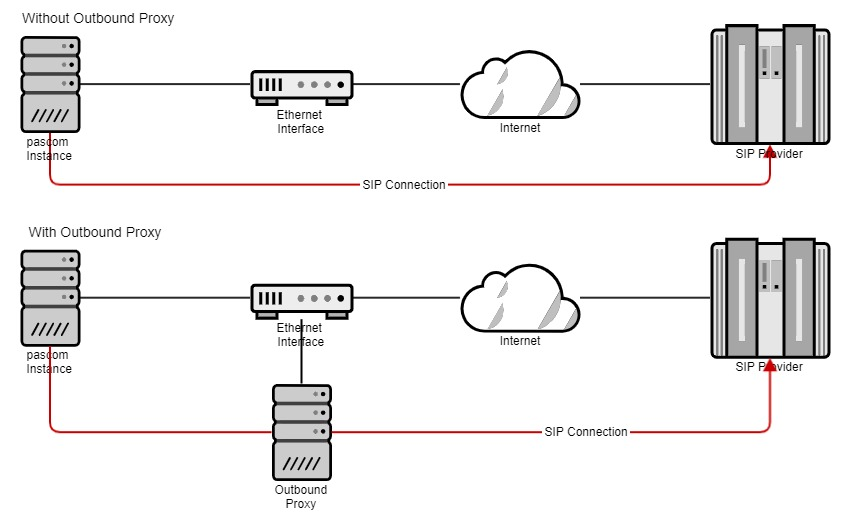
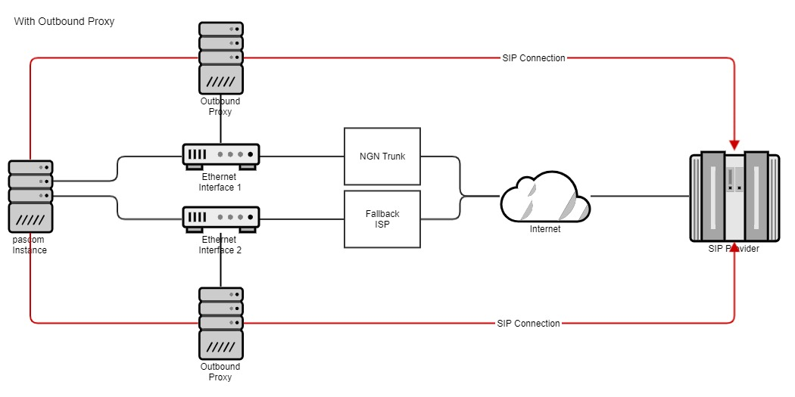
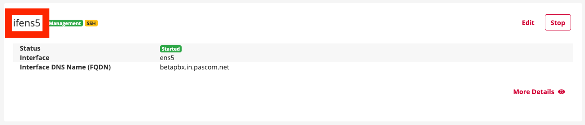





## Concept

The outbound proxy manages and monitors registration and SIP packages to your provider. In addition, the outbound proxy SIP header is optimized with additional parameters to enable more efficient routing of the SIP data streams within the pascom telephone system. As a result, cumbersome NAT masquerading is a thing of the past and thus provokes users of NGN trunks in particular.



Without an outbound proxy, the pascom instance speaks directly to the SIP provider and also requires a configuration of the NAT. By using the outbound proxy, it takes care of the SIP data streams, making it unnecessary to adapt the NAT.

## Use of an NGN trunk on separate interfaces

The outbound proxy of the pascom telephone system is located on the Ethernet interfaces. This allows the outbound proxy to be assigned to any interface. This allows you to configure the connection to your provider on one interface, while another provider, for example, is set up as fallback on the other interface.



## Outbound Proxy usage

Setting up the outbound proxy is very easy. In the [basic settings] () of your Trunks under
> >  select the appropriate interface on which the outbound proxy should run actively.

**Important** For the changes to take effect, the entire host (pascom system) must be restarted!


## Use outbound proxy in CSP installation

In the case of a CSP installation, the outbound proxy cannot be set in the trunk configuration but is configured using a file in the instance in order to prevent incorrect configurations by the instance admin and to be able to specifically manage the traffic.

To do this, log in to the respective CSP host using SSH, enter the desired instance via `lxc-attach INSTANZNAME` and generate the file `/etc/pascom/sipproxy.json` with the following content:

```
{
    "PROVIDER-HOST-DNSNAME": {
        "proxy": "HOSTNAME-CONTAINERNAME.cs-proxy.service.pascom",
        "options": "SIP-OPTIONS"
    }
}
```

Replace the uppercase variables as follows:

**PROVIDER-HOST-DNSNAME**

Enter the host name of the provider for which you want to use an outbound proxy. This will apply this configuration to all trunks that use this host as a registrar.
E.g. for Deutsche Telekom `tel.t-online.de`.

**HOSTNAME-CONTAINERNAME**

Replace `HOSTNAME` with the host name of the CSP host and `CONTAINERNAME` with the name of the interface container that you want to use as an outbound proxy.

You can determine the host name via SSH:

```
~ # hostname
csphost01
~ #
```

You can read the name of the interface in the Management UI under :



In our example, `HOSTNAME-CONTAINERNAME` is to be replaced by `csphost01-ifens5`.

**SIP OPTIONS**

Here you can force additional SIP options for this trunk, which can no longer be overridden by the instance admin.

It is important that each SIP option ends up in a separate line. You can do this with `\n` at the beginning and end of each option.

E.g. `\ntransport=tcp\n` to always force SIP TCP.

### Complete sample file for Telekom

```
{
    "tel.t-online.de": {
        "proxy": "csphost01-ifens5.cs-proxy.service.pascom",
        "options": "\ntransport=tcp\n"
    }
}
```

### (Optional) Roll out the configuration on the entire CSP host

Instead of creating the file `/etc/pascom/sipproxy.json` in every instance, you can also enter it in the central Consul database.

To do this, log in to the CSP host via SSH, become root and create the file `/tmp/sipproxy.json` with the same content as described above.

The configuration is then entered in the Consul database via:

```
~ # consul kv put config/HOSTNAME/system/outboundproxy @/tmp/sipproxy.json
```

Replace `HOSTNAME` with the hostname of the CSP host.


### Apply configuration

To activate the configuration, log in to the respective instance using the web UI and click on > > .

If the file `/etc/pascom/sipproxy.json` was created correctly, you can see the usage of the outbound proxy in the log of the apply job:

```
Will route trunk [telekom] via proxy [csphost01-ifens5.cs-proxy.service.pascom]
```