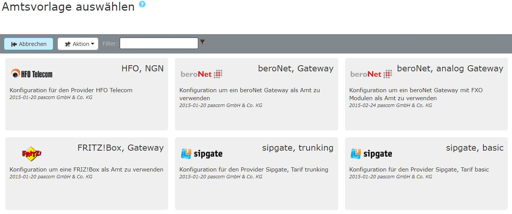







## Amtsvorlagen verwenden

Fügen Sie ein neues Amt ein unter  >  > . Sie gelangen nun zur Ämter-Datenbank. Hier finden Sie Vorlagen für alle von pascom unterstützten und von uns getesten Ämter.  
Über den Filter können Sie direkt nach Ihrem Amt suchen und anschließend auswählen. 

Befüllen Sie die Vorlage mit Ihren Daten, die Sie von Ihrem Telefonanbieter erhalten haben.  
Da verschiedene Ämter-Typen unterschiedliche Variablen benötigen finden Sie im folgendem eine Übersicht:

|Variable|Erklärung|
|---|---|
|**Bezeichung**|Geben Sie Ihrem Amt einen Namen, dieser taucht dann in der Ämterliste auf|
|**Internationale Vorwahl**|Die Ziffer die vorangestellt werden muss um im Festnetz eine internationale Nummer (Ausland) zu erreichen. Im Normalfall ist das die *00*.|
|**Nationale Vorwahl**|Die Ziffer die vorangestellt werden muss um im Festnetz eine nationale Nummer (Nummer mit Ortsvorwahl) zu erreichen. Im Normalfall ist das die *0*.|
|**Länderkennung**|Geben Sie hier die Landeskennzahl für das Land an in dem sich das Amt befindet. Für Deutschland z. B. 49. Durch die IP-Ämter ist es möglich, dass sich die pascom zwar in Deutschland befindet jedoch über das Internet ein Amt in der Schweiz nutzt. Geben Sie hier immer die Landeskennzahl an in dem sich das Amt befindet, nicht den Standort der Anlage.|
|**Ortskennzahl**|Tragen Sie die Ortskennzahl bzw. Ortsvorwahl ohne führende 0 ein. Für München z. B. 89 statt 089.|
|**Stammnummer**|Das ist die Basisnummer Ihres Telefonanschusses.|
|**Präfix eing. Nummer**|Ist eine beliebige Ziffer, die bei eingehenden Telefonanrufen über dieses Amt vorangestellt wird. Wenn Sie hier eine 0 eingeben erscheint beispielsweise in der Anruferliste von IP-Telefonen dann nicht die 0172123123 sondern die 00172123123. Dadurch können Sie direkt aus der Anruferliste wieder über das selbe Amt zurückrufen.|
|**Anzahl der Durchwahlstellen**|Anzahl der Stellen der Benutzer-Durchwahlen. (NICHT die Anzahl der Nummern im Rufnummernblock!)|
|**Durchwahl der Zentrale**|Geben Sie hier an, auf welche interne Durchwahl die erste Nummer Ihres Rufnummernblocks (meistens die 0) abgeworfen werden soll.|

## pascom maintained Amtsvorlagen

Von pascom verwaltete Amtsvorlagen erleichtern den Wartungsaufwand Ihrer eingerichteten Ämter. Hin und wieder kommt es vor, dass sich Verbindungsdaten und Optionen von Seiten eines Providers ändern. Die von pascom verwalteten Amtsvorlagen updaten sich in diesem Fall selbständig, was Ihnen manuelle Anpassungen erspart.  

Entnehmen Sie unserer Liste für [unterstützte Amtsvorlagen]() welche Templates von pascom verwaltet werden.

### pascom maintained Amtsvorlagen selbst anpassen

Möchten Sie selbst Änderungen an Templates vornehmen, die von pascom verwaltet werden, muss die gesamte Vorlage auf ein generisches Template umgestellt werden. 

{}
Bitte beachten Sie, dass nach einer Umstellung der Amtsvorlage auf ein generisches Template, keine Änderungen oder Updates mehr von pascom durchgeführt werden. 
{}

### pascom maintained Amtsvorlage umstellen

Editieren Sie Ihr Amt unter  >  > . Dort finden Sie den Button 

Wählen Sie nun aus der Vorlagenliste das **generische SIP-Amt** aus. 

Ihnen stehen nun alle SIP-Optionen zur Verfügung, um diese manuell anzupassen.

Abschließend übernehmen Sie die Änderungen über **Telefoniekonfig anwenden**.

{}
Sie können Ihr Amt jederzeit wieder zurück auf eine pascom maintained Amtsvorlage stellen.
{}