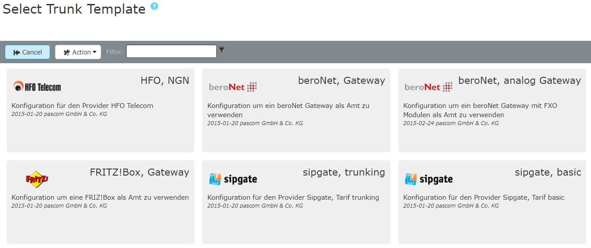







## Trunk Templates

Add a new trunk under `Gateways` > `Trunks` > `+Add`. This will direct you to the SIP provider database where you can find templates for all supported and certified trunks, plus the manual configuration options.  
Using the filter tool, you can search for your trunk. If your provider is not listed, please use the `Manual SIP` option. 

Enter the required data in the setup template, which you received from your Telephony Provider.  
As different Trunk types require different variables, please refer to the overview below:

|Variable|Description|
|---|---|
|**Name**|Enter a name for the trunk, which is then displayed in the Trunks overview list |
|**International Prefix**|The characters or numbers needed to dial international numbers - ordinarily *00*.|
|**Country Code**|Enter the country code for the Trunk's originating country. For example, the UK is **44**. SIP trunks allow you to have your phone system server located in one country and register it with a trunk from another country via the internet. Therefore, enter the country code for where the Trunk is located, not the phone system server. |
|**National Prefix**|The numbers which need to be dialled in order to make a call to a national landline (with an area code) - ordinarilly *0*.|
|**Area Code**|Enter the area code (excluding the proceeding 0). For example for London you would enter 20 instead of 020.|
|**Line / Subscriber Number**|The base number of your telephony connection.|
|**Prefix Incoming Number**|Any pre-set number which is attached to incoming calls via this trunk. If, for example, you enter a **0**, then calls to this number may appear in your IP phone's call history as `00172123123` instead of `0172123123`. This allows users to directly callback numbers in the call history using the same trunk over which the call came in.|
|**DID format**|Number format for user extensions - how many digits. (Not the total number in a Number (DID) Block!)|
|**Switchboard Extension**|Enter the internal extension on which calls to the first number in your number block (normally 0) should be routed.|

## pascom maintained Trunk Templates

Official templates maintained by pascom make it easier to maintain your Trunks. Occasionally, connection data and options on the side of a provider change. In this case, the official templates maintained by pascom update themselves, which saves you to make manual adjustments.

Please refer to our list for [supported trunk templates]() which templates are maintained by pascom

### Change pascom maintained Trunk Template

If you want to make changes yourself to templates that are maintained by pascom, the entire template must be converted to a generic template.

{}
Please note that after changing the pascom maintained template to a generic template, pascom will no longer make any changes or updates. 
{}

### Switch pascom maintained Trunk Template

Edit your Trunk via  >  > . Here you can find the Button 

Now select the **generic SIP Trunk** from the list of templates.

All SIP options are now available to you to adjust them manually.

Finally, apply the changes via **apply Telephony Config**.

{}
You can change your Trunk back to a pascom maintained template at any time.
{}